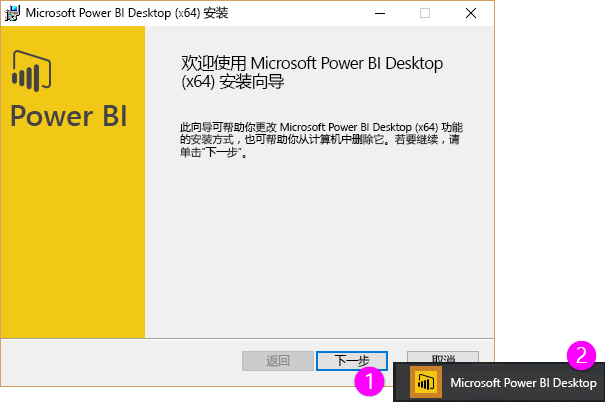

# 获取 Power BI Desktop
**Power BI Desktop** 允许用户生成高级查询、模型和实现数据可视化效果的报表。 通过 Power BI Desktop，可以生成数据模型、创建报表，并通过发布到 Power BI 服务共享工作。  **Power BI Desktop** 可免费下载。

可以通过两种方法获取 Power BI Desktop，以下部分将介绍这两种方法：

* 直接下载（在计算机上下载并安装 MSI 包）
* 作为 **Microsoft Store** 的应用安装

这两种方法都会将最新版本的 Power BI Desktop获取到计算机上，但值得注意的是这两种方法存在一些区别，以下部分将具体介绍。

## 下载 Power BI Desktop
若要下载最新版 **Power BI Desktop**，可以依次选择 Power BI 服务右上角的下载图标和“**Power BI Desktop**”。

还可以在下面的下载页面中下载最新版 Power BI Desktop：

* [**Power BI Desktop 下载**（ 32 位和 64 位版本）](https://powerbi.microsoft.com/desktop)。
  
  

无论选择哪种下载方式，下载 **Power BI Desktop** 后，系统便会立即提示你运行安装文件：

**Power BI Desktop** 会当作一个应用程序进行安装，并在桌面上运行。

> [!NOTE]
> 不支持在同一台计算机上安装下载的 (MSI) 版本和 Microsoft Store 版本的 Power BI Desktop（有时称为“并行”安装）。
> 
> 

## 作为 Microsoft Store 的应用安装
还可以使用以下链接从 Microsoft Store 获取 Power BI Desktop：

* [通过 Microsoft Store 安装 Power BI Desktop](http://aka.ms/pbidesktopstore)

从 Microsoft Store 获取 Power BI Desktop 有以下几个优点：

* **自动更新** - Windows 自动在后台下载已发布的最新版本，以便始终可以不断更新版本。
* **较小下载** - Microsoft Store 可确保只将每次更新中更改的组件下载到计算机，从而减少每次更新的下载量。
* **不需要管理员权限** - 直接下载并安装 MSI 时，必须是管理员，才能成功完成安装。 从 Microsoft Store 获取 Power BI Desktop 时，则不需要管理员权限。
* **已启用 IT 推出** - 可更轻松地部署 Microsoft Store 版本，或向组织中的所有人推出版本，并可通过适用于企业的 Microsoft Store 提供 Power BI Desktop。
* **语言检测** - Microsoft Store 版本包括所有受支持的语言，并在每次启动计算机时查看所使用的语言。 这还会影响 Power BI Desktop 中创建的模型的本地化；例如，内置日期层次结构将匹配创建 .pbix 文件时 Power BI Desktop 所使用的语言。

从 Microsoft Store 安装 Power BI Desktop 时，需要注意以下几个注意事项和限制：

* 如果使用 SAP 连接器，可能需要将 SAP 驱动程序文件移动到 Windows\System32 文件夹。
* 通过 Microsoft Store 安装 Power BI Desktop 的过程不从 MSI 版本复制用户设置。 可能需要重新连接到最新数据源并重新输入数据源凭据。 

> [!NOTE]
> 不支持在同一台计算机上安装下载的 (MSI) 版本和 Microsoft Store 版本的 Power BI Desktop（有时称为“并行”安装）。 应先手动卸载 Power BI Desktop，然后再从 Microsoft Store 下载它
> 
> [!NOTE]
> Power BI 报表服务器版本 Power BI Desktop 与本文中介绍的版本分开安装，并且安装步骤也不同。 若要了解报表服务器版本 Power BI Desktop，请参阅[快速入门：创建 Power BI 报表服务器的 Power BI 报表](report-server/quickstart-create-powerbi-report.md)一文。
> 
> 

## 使用 Power BI Desktop
启动 **Power BI Desktop** 时，将显示欢迎屏幕。

如果用户是首次使用 Power BI Desktop（如果安装不是为了升级），系统会提示填写表单，并回答几道问题，或提示必须先登录 Power BI 服务，然后才能继续操作。

你可以在此处开始创建数据模型或报表，然后在 Power BI 服务上与他人共享。 请查看文末的**详细信息**链接，以链接到可帮助你开始使用 **Power BI Desktop** 的指南。

## 最低要求
以下列表提供了运行 **Power BI Desktop** 的最低要求：

* Windows 7/Windows Server 2008 R2 或更高版本
* .NET 4.5
* Internet Explorer 9 或更高版本
* **内存 (RAM)：**可用量至少为 1 GB，建议量为 1.5 GB 或以上。
* **显示：**建议分辨率至少为 1440x900 或 1600x900 (16:9)。 不建议使用如 1024x768 或 1280x800 等较低分辨率，原因是某些控件（如关闭启动屏幕）需要更高的分辨率才能显示。
* **Windows 显示设置：**如果将显示设置设为将文本、应用和其他项的大小更改为大于 100%，可能看不到某些必须先关闭或响应才能继续使用 Power BI Desktop 的对话框。 如果遇到此问题，请在 Windows 中依次转到“设置”>“系统”>“显示”，检查“显示设置”，再使用滑块将显示设置恢复为 100%。
* **CPU：**建议为 1 千兆赫 (GHz) 或更快的 x86 或 x64 位处理器。

## 后续步骤
一旦安装了 **Power BI Desktop**，以下内容可帮助你快速启动和运行：

* [Power BI Desktop 入门](desktop-getting-started.md)
* [Power BI Desktop 的查询概述](desktop-query-overview.md)
* [Power BI Desktop 中的数据源](desktop-data-sources.md)
* [连接到 Power BI Desktop 中的数据](desktop-connect-to-data.md)
* [使用 Power BI Desktop 调整和合并数据](desktop-shape-and-combine-data.md)
* [Power BI Desktop 中的常见查询任务](desktop-common-query-tasks.md)   

