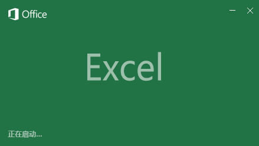

欢迎进入 Power BI **引导学习**课程的 **Power BI 和 Excel** 部分。

很可能你已经使用过 **Excel**。 或许你曾使用 Excel 创建或查看报表，或生成饼图或其他视觉对象。 或者你可能曾使用 **Power Pivot** 或 **Power Query** 生成技术性稍强的解决方案。 如果是这样，你将在 Power BI 中感到得心应手，你的工作薄也同样如此。

本节将向你介绍将 Excel 工作薄导入 Power BI 是多么简单，并演示 Power BI 和 Excel 如何展现最佳搭档气质。

## 在 Power BI 中使用 Excel 数据简介
*观看 Excel 和 Power BI 服务协同工作方式的简介*

凭借 Power BI，将你的 Excel 数据导入 Power BI 是非常简单的。

以下主题将指导你使用简单的表格将 Excel 工作薄上传到 Power BI。 然后你将了解如何上传使用 Excel 更高级的 BI 数据建模和报表功能（如 Power Pivot 和 Power View）创建的工作薄。

你还将了解到将 Excel 工作薄文件保存到 One Drive for Business 的一些优点。 从 Power BI 连接到 OneDrive 上的 Excel 文件时，你在 Power BI 中的报表和仪表板将在你作出更改并保存工作时自动更新和刷新。

