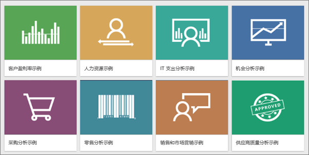
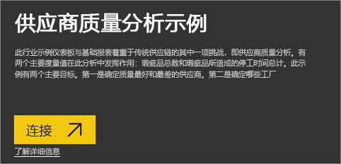
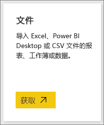
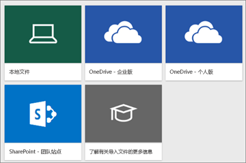
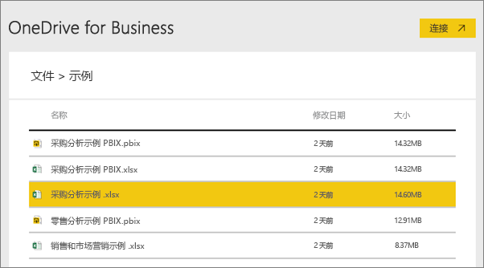
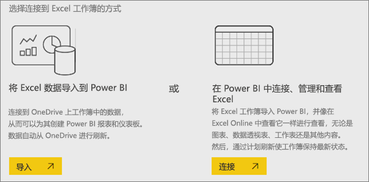
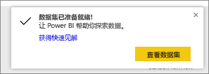
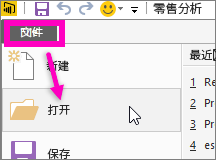

# 有哪些示例数据可用于 Power BI？
假设你初次接触 Power BI，想要试用但没有任何数据。  或者你有一个数据集，但由于你（尚）不了解 Power BI 的工作原理，担心由于某种原因可能损坏数据集？

不需要有压力！ obviEnce ([www.obvience.com](http://www.obvience.com/)) 和 Microsoft 已创建示例供你使用，直到你可以更放心地使用 Power BI。  数据经过匿名处理并表示不同行业：金融、人力资源、销售等。 随着你不断阅读我们的联机文档，将会发现使用这些相同示例的教程和示例，这意味着，你将能够沿用这些内容。      

   

每个示例都可以采用以下几种格式：内容包、单独的 Excel 工作簿和 .pbix 文件。 如果你不知道这些内容是什么，或如何着手处理，请不要担心。 我们将在本文后续部分介绍这些内容。 我们针对每个示例创建了一个 *教程* ，这是一种文章类型，介绍示例所基于的场景并指导你完成不同的方案。 一种方案可能是回答经理的问题，另一个可能查找竞争对手的见解，或创建要共享的报表和仪表板，或解释业务转型。   

但在我们开始之前，请通读使用示例的法律准则。 完成后，我们将介绍这些示例并向你展示如何使用它们。   

## Power BI 示例 Excel 工作簿的使用准则
请在使用 Power BI 示例之前阅读此信息。

© 2015 Microsoft Corporation。 保留所有权利。 文档和工作簿“按原样”提供。 工作簿中陈述的信息和观点（包括 URL 和其他 Internet 网站引用）如有更改，恕不另行通知。 你须自行承担使用风险。 某些示例仅供说明之用，纯属虚构。 不作任何实际关联，也不推断任何实际关联。 对于此处提供的信息，Microsoft 不作任何明示或暗示的担保。

对于任何 Microsoft 产品中的任何知识产权，工作簿不为你提供任何法律权利。 你可以复制此工作簿并将其用于内部参考。

工作簿和相关的数据由 obviEnce 提供。 [www.obvience.com](http://www.obvience.com)

ObviEnce 是侧重于 Microsoft Business Intelligence 的 ISV 和知识产权 (IP) Incubator。 ObviEnce 与 Microsoft 紧密协作，共同开发快速了解和部署 Microsoft Business Intelligence 解决方案的最佳做法和领先观念。

工作簿和数据均为 obviEnce, LLC 的财产，并已共享以专门用于通过行业示例数据演示 Power BI 功能。

工作簿和/或数据的任何使用必须包括上述属性（也位于每个工作簿随附的信息工作表上）。 该工作簿和任何可视化对象必须附有以下版权声明：obviEnce ©。

单击下面任一链接下载 Excel 工作簿文件或 .pbix 文件即表示你同意上述条款。

## 可用示例
我们提供八个示例供你使用。  每个示例代表不同的行业。

### 客户盈利率示例 
[浏览客户盈利率示例](sample-customer-profitability.md)

此行业示例分析了 CFO 对其管理人员、产品和客户的关键指标。 你可以调查哪些因素会影响公司的盈利率。

### 人力资源示例 
[浏览人力资源示例](sample-human-resources.md)

此行业示例通过分析新员工、在职员工和离职员工关注公司的招聘策略。  通过浏览数据，你可以找到自愿离职和招聘策略中的偏见的趋势。

### IT 支出分析示例 
[浏览 IT 支出分析示例](sample-it-spend.md)

在本行业示例中，我们分析比较了公司 IT 部门的计划成本与实际成本。 这种比较可以帮助我们了解公司年度计划的效果如何并调查与计划有巨大偏差的区域。 在此示例中，公司将经历年度计划周期，然后分季度生成新的最新估计 (LE)，以帮助分析过去财年中 IT 支出的变化。

### 机会分析示例  
[浏览机会分析示例](sample-opportunity-analysis.md)

此行业示例探索软件公司的销售渠道。 销售经理通过按地区、交易规模和渠道跟踪机会和收益来监视其直接和合作销售渠道。

### 采购分析示例  
[浏览采购分析示例](sample-procurement.md)

此行业示例分析了 CFO 对其管理人员、产品和客户的关键指标。 你可以调查哪些因素会影响公司的盈利率

### 零售分析示例 
[浏览零售分析示例](sample-retail-analysis.md)

此行业示例分析了跨多个商店和地区销售的商品的零售数据。 指标将比较本年度与去年在以下领域的绩效：销售、单位、毛利和差额，以及新店铺分析。

### 销售和市场营销示例 
[浏览销售和市场营销示例](sample-sales-and-marketing.md)

此行业示例分析了制造公司 VanArsdel Ltd。它允许首席市场官监视该行业以及 VanArsdel 的市场份额。  通过浏览示例，你可以找到公司的市场份额、产品量、销售和市场情绪。

### 供应商质量示例 
[浏览供应商质量示例](sample-supplier-quality.md)

此行业示例着重于传统供应链的其中一项挑战 — 供应商质量分析。 有两个主要度量值在此分析中发挥作用：瑕疵品总数和瑕疵品所造成的停工时间总计。 此示例有两个主要目标：了解质量方面最佳和最差的供应商，并确认在找出及剔除瑕疵品方面表现更佳的工厂，从而最大限度地缩短停工时间。

现在你已经知道可用的内容了。 可以开始了解如何获取这些示例。  

## 如何获取这些示例
正如你上面所了解到的那样，这些示例以几种格式提供：内容包、Excel 工作簿和 .pbix 文件。 我们将介绍如何使用每种示例，首先从内容包开始。

## 内容包 Power BI 示例
内容包是可从 Power BI 中获取的唯一示例格式，无需离开 Power BI 就能找到内容包。 内容包实质上是用户创建且可与 Power BI 服务一起使用的一个或多个仪表板、数据集和报表的捆绑包。 用户创建内容包与同事共享。 每个 Power BI 示例内容包都包含一个数据集、报表和仪表板。  内容包对 Power BI Desktop 不可用。 如果你想要了解有关内容包的详细信息，请阅读 [Power BI 中的内容包简介](service-organizational-content-pack-introduction.md)。

### 在 Power BI 服务中获取并打开示例内容包
1. 打开 Power BI 服务 (app.powerbi.com)，并登录。
2. 在左下角，选择“**获取数据**”。
   
    
3. 在显示的“获取数据”页上选择“**示例**”图标。
   
   
4. 选择其中一个示例以打开该示例的说明。 然后选择“**连接**”。  
   
   
5. Power BI 导入内容包，并将新的仪表板、报表和数据集添加到当前工作区。 新的内容会以黄色星号标记。 使用这些示例对 Power BI 进行测试运行。  
   
   

现在你拥有数据，已经快成功了。  使用示例内容包尝试按我们的一些教程操作，或仅打开 Power BI 服务并浏览。

## Excel 文件 Power BI 示例
每个示例内容包还可以作为 Excel 工作簿提供。 Excel 工作簿旨在与 Power BI 服务一起使用。  

1. 使用下面的链接分别下载文件，或[下载所有示例文件的 zip 文件](http://go.microsoft.com/fwlink/?LinkId=535020)。 如果你是高级用户，可能想要下载 Excel 工作簿以浏览或编辑数据模型。
   
   * [零售分析示例](http://go.microsoft.com/fwlink/?LinkId=529778)
   * [供应商质量分析示例](http://go.microsoft.com/fwlink/?LinkId=529779)
   * [人力资源示例](http://go.microsoft.com/fwlink/?LinkId=529780)
   * [客户盈利率示例](http://go.microsoft.com/fwlink/?LinkId=529781)
   * [机会跟踪示例](http://go.microsoft.com/fwlink/?LinkId=529782)
   * [IT 支出分析示例](http://go.microsoft.com/fwlink/?LinkId=529783)
   * [采购分析示例](http://go.microsoft.com/fwlink/?LinkId=529784)
   * [销售和市场营销示例](http://go.microsoft.com/fwlink/?LinkId=529785)
2. 保存下载的文件。 保存文件的位置不同会造成一定的差异。
   
   *   **本地** - 如果你将文件保存到计算机上的本地驱动器中或者组织中的其他位置，则在 Power BI 中，你可以将文件导入到 Power BI。 你的文件实际上一直保存在本地驱动器中，因此整个文件并未真正导入到 Power BI。 实际上，在 Power BI 网站中创建新的数据集，数据（某些情况下为数据模型）将加载到数据集中。 如果你的文件有任何报表，则这些报表会显示在你的 Power BI 网站中的“报表”下。
   *  **OneDrive - 企业** – 如果你有 OneDrive for Business，并且使用登录 Power BI 的同一帐户登录到其中，这是将 Excel、Power BI 或 .CSV 文件中的工作与你在 Power BI 中的数据集、报表和仪表板保持同步的有史以来最有效的方法。 由于 Power BI 和 OneDrive 都位于云中，Power BI 大约每小时会连接你在 OneDrive 上的文件一次。 如果发现任何更改，你的数据集、报表和仪表板会在 Power BI 中自动更新。
   *  **OneDrive - 个人** – 如果你将文件保存到自己的 OneDrive 帐户，你会像使用 OneDrive for Business 那样获得很多相同优势。 最大的不同之处在于，当你首次连接至你的文件（使用“获取数据 > 文件 > OneDrive – 个人”）时，你将需要使用 Microsoft 帐户登录 OneDrive，这通常与你用于登录 Power BI 的帐户不同。 当使用你的 Microsoft 帐户登录 OneDrive 时，请务必选择“使我保持登录状态”选项。 这样一来，Power BI 将能够大约每小时连接你的文件一次，并确保你在 Power BI 中的数据集同步。
   *  **SharePoint 团队网站** – 将 Power BI 文件保存到 SharePoint 团队网站与保存到 OneDrive for Business 大致相同。 最大的区别是你从 Power BI 连接到文件的方式。 你可以指定一个 URL 或连接到根文件夹。
3. 打开 Power BI 服务 (app.powerbi.com)，并登录。
   
   > [!TIP]
   > 现在，你可能想要创建新的仪表板并以计划进行导入的文件的名称对其命名。  否则，在导入 Excel 数据集时，Power BI 将不会创建以示例命名的新仪表板，而改为将磁贴添加到当前已打开的仪表板。 选择该磁贴将转到数据集的报表。 这不是什么大问题，因为你稍后也可以创建新仪表板，但从新仪表板开始操作将为你节省一个或两个步骤。
   > 
   > 
4. 在左下角，选择“**获取数据**”。
   
    
5. 在显示的“获取数据”页上，选择“**文件 > 获取**”。
   
     
6. 导航到下载并保存示例的位置。
   
   
7. 选择该文件，此处是保存在 OneDrive for Business 上的 **Procurement Analysis Sample.xlsx**，然后选择“**连接**”。
   
   
8. 选择是导入数据，还是将工作簿引入 Power BI 并完全按照其在 Excel Online 中的方式查看该工作簿。
   
    
9. 如果选择“**导入**”，Power BI 会导入示例工作簿并将其添加为名为**采购分析示例**的新数据集。  如果工作簿具有任何 Power View 工作表、表或范围，或数据模型，Power BI 还会创建一个（具有相同的名称）的报表。 如果还没有打开仪表板，Power BI 将创建一个新的仪表板。 （如果在单击“**获取数据**”时打开了仪表板，则会在该仪表板上看到新的空白磁贴。  单击该磁贴将转到刚刚添加数据集的报表）。 新内容以该示例命名，并以黄色星号标记。
10. 当**数据集准备就绪！** 屏幕出现时，选择“**查看数据集**”或“**获取快速见解**”，或只需使用 Power BI 左侧导航栏来找到并打开关联的报表或仪表板。  
    
     

### （可选）从 Excel 内查看 Excel 示例
想要了解 Excel 工作簿中的数据如何转换为 Power BI 数据集和报表？ 通过***在 Excel 中***打开 Excel 示例和浏览工作表可得到答案。

* 首次在 Excel 中打开示例工作簿时，你可能会看到两个警告。 第一个警告指出工作簿处于受保护的视图中。 选择“启用编辑”。 第二个警告指出该工作簿有外部数据连接。 选择“启用内容”。
* 每个工作簿包含多个工作表。 由于所有这些 Excel 示例都至少有一个包含可视化效果的 Power View 工作表，在将 Excel 文件导入到 Power BI 时，你将会获得一个数据集**和**一个报表。
  
   你可能需要[启用 Power View 外接程序](https://support.office.com/article/Create-a-Power-View-sheet-in-Excel-2013-B23D768D-7586-47FE-97BD-89B80967A405#__toc328591957)。
* 那么实际数据在哪儿呢？ 实际数据位于 Power Pivot 数据模型中。 若要查看数据，在“PowerPivot”选项卡上，选择“管理数据模型”。
  
    看不到 PowerPivot 选项卡？ [启用 Power Pivot 外接程序](https://support.office.com/article/Start-Power-Pivot-in-Microsoft-Excel-2013-add-in-A891A66D-36E3-43FC-81E8-FC4798F39EA8)。 
* “信息”选项卡提供有关创建该示例的公司 obviEnce 的信息。

## .pbix 文件 Power BI 示例
每个示例内容包还会作为 Power BI .pbix 文件提供。 .pbix 文件旨在与 Power BI Desktop 一起使用。  

1. 使用下面的链接单独下载各个文件。
   
   * [零售分析示例](http://download.microsoft.com/download/9/6/D/96DDC2FF-2568-491D-AAFA-AFDD6F763AE3/Retail Analysis Sample PBIX.pbix)
   * [供应商质量分析示例](http://download.microsoft.com/download/8/C/6/8C661638-C102-4C04-992E-9EA56A5D319B/Supplier-Quality-Analysis-Sample-PBIX.pbix)
   * [人力资源示例](http://download.microsoft.com/download/6/9/5/69503155-05A5-483E-829A-F7B5F3DD5D27/Human Resources Sample PBIX.pbix)
   * [客户盈利率示例](http://download.microsoft.com/download/6/A/9/6A93FD6E-CBA5-40BD-B42E-4DCAE8CDD059/Customer Profitability Sample PBIX.pbix)
   * [机会跟踪示例](http://download.microsoft.com/download/9/1/5/915ABCFA-7125-4D85-A7BD-05645BD95BD8/Opportunity Analysis Sample PBIX.pbix)
   * [IT 支出分析示例](http://download.microsoft.com/download/E/9/8/E98CEB6D-CEBB-41CF-BA2B-1A1D61B27D87/IT Spend Analysis Sample PBIX.pbix)
   * [采购分析示例](http://download.microsoft.com/download/D/5/3/D5390069-F723-413B-8D27-5888500516EB/Procurement Analysis Sample PBIX.pbix)
   * [销售和市场营销示例](http://download.microsoft.com/download/9/7/6/9767913A-29DB-40CF-8944-9AC2BC940C53/Sales and Marketing Sample PBIX.pbix)
2. 保存下载的文件。
3. 在 Desktop 上，选择“**文件 > 打开**”并导航到保存示例 .pbix 的位置。
   
   
4. 选择要在 Desktop 中打开的 .pbix 文件。

## 后续步骤
[Power BI 基本概念](service-basic-concepts.md)

[教程：连接到 Power BI 示例](sample-tutorial-connect-to-the-samples.md)

[Power BI 数据源](service-get-data.md)

更多问题？ [尝试参与 Power BI 社区](http://community.powerbi.com/)

