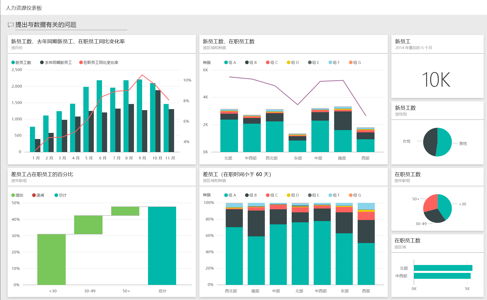
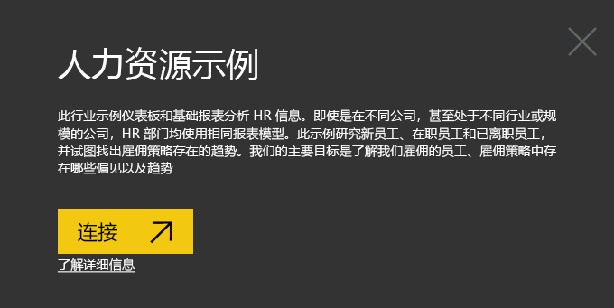
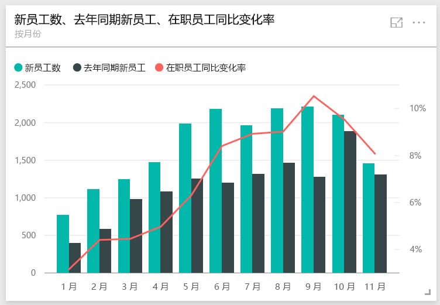
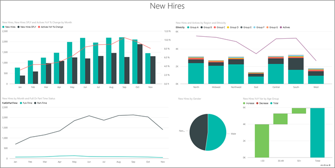
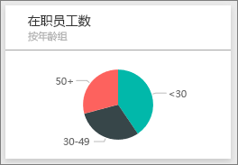
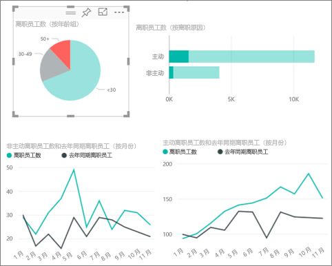
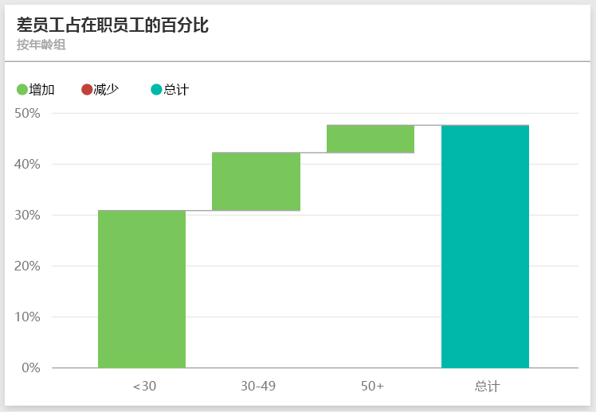
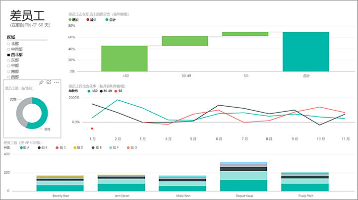
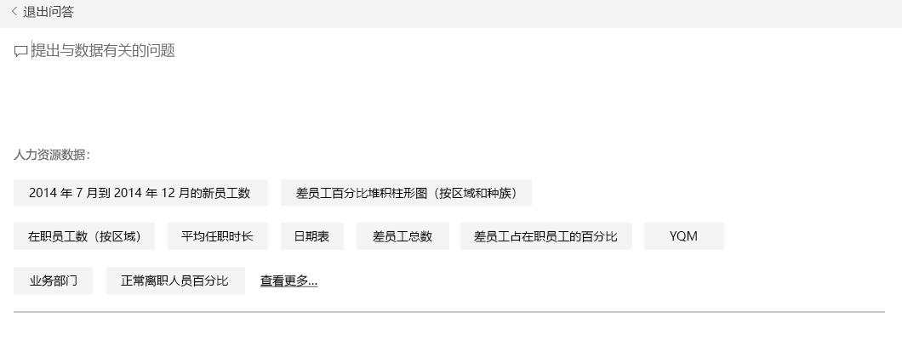
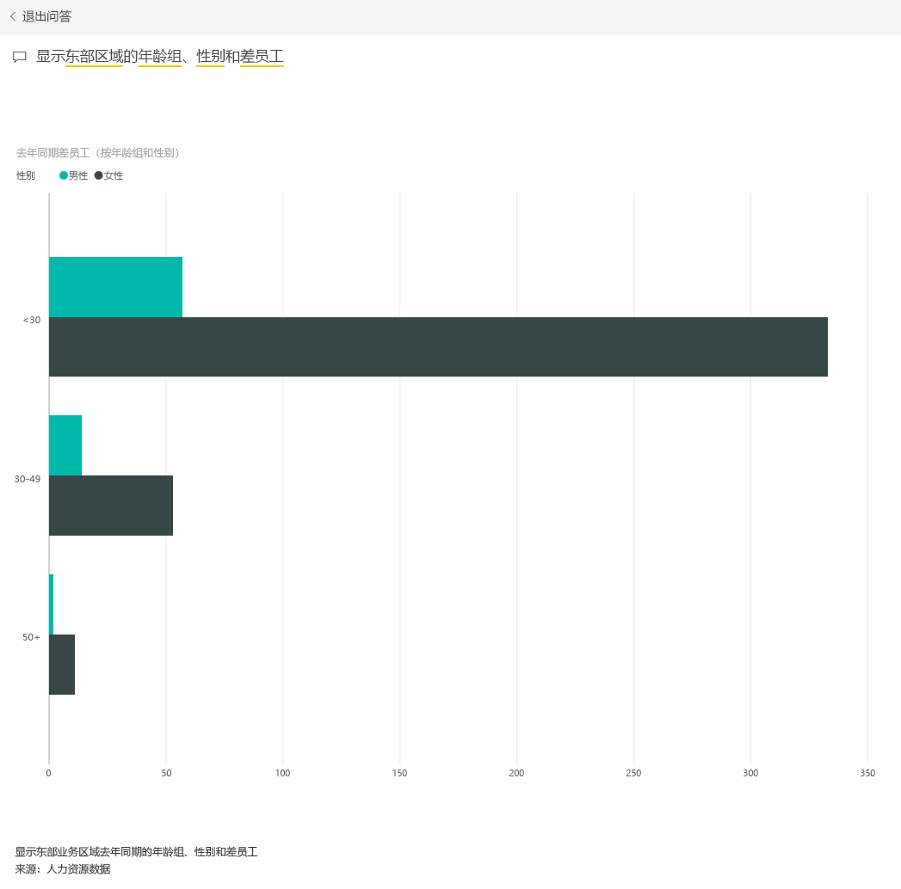

# Power BI 的人力资源示例：教程

## “人力资源示例”概述
即使是在不同公司，甚至处于不同行业或规模的公司，HR 部门均使用相同报表模型。 此示例研究新员工、在职员工和已离职员工，并试图找出雇佣策略存在的趋势。 我们的主要目标是要了解：

* 我们招聘的员工
* 我们招聘策略中的偏见
* 自愿离职趋势

此示例是一系列教程的一部分，该系列教程阐明如何将 Power BI 与面向业务的数据、报表及仪表板搭配使用。 这些来自 obviEnce [(www.obvience.com)](http://www.obvience.com/) 的真实数据都已进行匿名处理。 数据可采用以下几种格式：内容包/应用程序、 Excel 工作簿或 .pbix Power BI Desktop 文件。 若要了解详细信息，请参阅[示例数据集](sample-datasets.md)。

## 先决条件

 必须先将示例下载为内容包、.pbix 文件或 Excel 工作簿，然后才能使用它。

### 获取内容包形式的此示例

1. 打开并登录 Power BI 服务 (app.powerbi.com)。
2. 在左下角，选择“**获取数据**”。
   
    
3. 在显示的“获取数据”页上选择“**示例**”图标。
   
   
4. 依次选择“人力资源示例”和“连接”。  
   
   
5. Power BI 导入内容包，并将新的仪表板、报表和数据集添加到当前工作区。 新的内容会以黄色星号标记。 
   
   
  
### 获取 .pbix 文件形式的此示例

也可以将此示例下载为 .pbix 文件，这是专为 Power BI Desktop 量身定制的文件格式。 

 * [人力资源示例](http://download.microsoft.com/download/6/9/5/69503155-05A5-483E-829A-F7B5F3DD5D27/Human Resources Sample PBIX.pbix)

### 获取 Excel 工作簿形式的此示例
还可以针对此示例[仅下载该数据集（Excel 工作簿）](http://go.microsoft.com/fwlink/?LinkId=529780)。 该工作簿包含你可以查看和修改的 Power View 工作表。 若要查看原始数据，请选择“Power Pivot”>“管理”。

## 新员工
首先来了解一下新员工。

1. 在工作区中，选择“仪表板”选项卡，并打开“人力资源”仪表板。
2. 在仪表板上，选择“新员工计数、上一年同时段的新员工和在职员工的**按月**增长率变化”磁贴。  
     

   将打开“人力资源示例”报表的**新员工**页。  

   

注意以下方面：

* **新员工计数、去年同时段的新员工和在职员工的按月增长率变化**组合图显示，今年我们每个月招聘的员工都比去年多，有几个月尤其明显。
* 从**按地区和种族划分的新员工计数和在职员工计数**组合图可以看出，我们在**东部**区域招聘的员工较之更少。
* **按年龄组划分的新员工增长率变化**瀑布图显示，我们主要招聘的是年轻员工。 这可能是由于我们大部分工作都是兼职性质。
* **按性别划分的新员工计数**饼图显示，男女员工数量平分秋色。

还有更多发现吗？例如，是否可以找到某个区域的性别划分不平均？ 选择图表中的不同年龄组和性别，了解年龄、性别、区域和种族组之间的关系。

从顶部导航栏选择仪表板的名称以返回到该仪表板。

## 当前在职员工和前任员工的比较
我们来看看当前在职员工和不再在公司工作的员工数据。

在仪表板上，选择**按年龄组划分的在职员工计数**磁贴。  

将打开“人力资源示例”报表的**在职员工对比离职员工**页。  

**相关项**：

* 在左侧的组合图显示在职员工和离职员工的同比变化。 由于大量招聘，今年的在职员工比去年多，同时离职员工也比去年多。
* 八月份的离职员工比其他几个月都多。 选择不同的年龄组、性别或区域，看看你是否能够找出任何其他不同。
* 我们注意到，在饼图中，按性别和年龄组划分的在职员工比例十分平均。 选择不同的年龄组，了解按年龄划分的性别差异。 每个年龄组中的性别划分是否都很平均？

## 离职原因
我们来看一看“编辑视图”中的报表。 选择左上角的**编辑报表**。

更改饼图以显示离职数据而不是在职数据。

1. 选择**按年龄组划分的在职员工计数**饼图。
2. 在“**字段**”中，选择“**员工**”旁边的箭头，展开“员工”表。 取消选中“**在职员工计数**”旁边的复选框，删除相应的字段。
3. 选择“员工”表中**离职员工计数**旁边的复选框，以将其完全添加到**值**框。
4. 回到报表画布上，选择**按离职原因划分的离职员工计数**条形图中的**主动离职**栏。 将在该报表的其他可视区突出显示主动离开的那些员工。
5. 单击“按年龄组划分的离职员工计数”饼图的 50+ 扇区。

   查看右下角的“按原因划分的离职员工”线形图。 此图经过筛选以显示主动离职的员工。  
   

   看出 50+ 年龄组中的趋势了吗？ 在该年的后半年，越来越多超过 50 岁的员工选择主动离职。 此部分需要提供更多数据进行进一步探索。
6. 你也可以遵循**按性别划分的在职员工计数**饼图中的相同步骤，将其更改为离职员工而不是在职员工。 查看按性别划分的主动离职员工数据，看看你是否能找出更多信息。
7. 单击顶部导航栏中的 **Power BI** 以返回到仪表板。 你可以选择是否保存对报表所做的更改。

## 差员工
要探究的最后一个部分是差员工。 差员工定义为上班不超过 60 天就走人的员工。 我们在不断招人。 我们招聘到好的候选员工了吗？

1. 选择**差员工占按年龄组划分的在职员工比例**仪表板磁贴。 将打开报表的第 3 页：“差员工”。

     
2. 选中左侧“地区”扇区中的“**西北**”复选框，并选择“按性别划分的错雇员工计数”环形图中的“**男性**”扇区。  查看“差员工”页上的其他图表。 男性差员工比女性要多并且 A 组中有很多差员工。
     
3. 查看**按性别划分的差员工**环形图并单击**区域**扇区，我们注意到，只有“东部”区域的女性差员工比男性多。  
4. 从顶部导航栏选择仪表板的名称以返回到该仪表板。

## 在“问答”框中提问
你可以使用自然语言在[问答问题框](power-bi-tutorial-q-and-a.md)中提问。 “问答”可以识别你键入的词语并指出可以在数据集的哪个位置找到答案。

1. 单击“问答”问题框。 请注意，在开始键入之前，问答框中提供了以下建议：

   
2. 你可以选择其中一个建议或类型：“显示区域为东部的去年同期的年龄组、性别和差员工”。  

   

   请注意，大多数女性差员工年龄都在 30 岁以下。

这是一个安全的试验环境。 你可以始终选择不保存所做的更改。 如果保存更改，则可以始终转到**获取数据**来获取本示例的新副本。

## 后续步骤：连接到你的数据
本教程讨论了 Power BI 仪表板、问答和报表如何能够帮助深入了解人力资源数据。 现在轮到你了 — 连接到你自己的数据。 借助 Power BI，你可以连接到各种数据源。 了解 [Power BI 入门](service-get-started.md)的详细信息。  
