# Power BI 的零售分析示例：教程

此行业示例仪表板和基础报表分析了跨多个商店和地区销售的商品的零售数据。 指标将本年度的绩效与去年在以下领域的绩效进行比较：销售、单位、毛利和方差，以及新店铺分析。 这些来自 obviEnce [(www.obvience.com)](http://www.obvience.com) 的真实数据都已进行匿名处理。

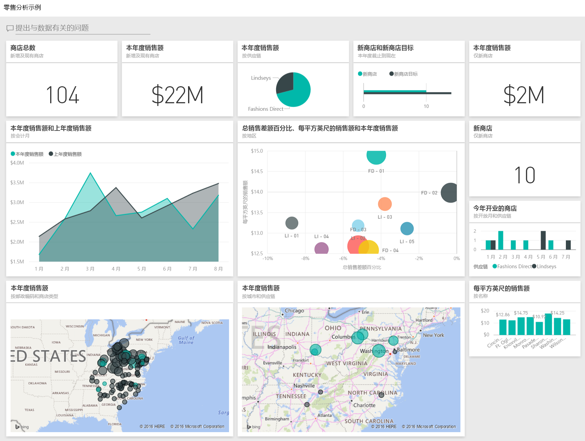

## 先决条件

 必须先将示例下载为[内容包](https://docs.microsoft.com/en-us/power-bi/sample-datasets#get-and-open-a-sample-content-pack-in-power-bi-service)、[.pbix 文件](http://download.microsoft.com/download/9/6/D/96DDC2FF-2568-491D-AAFA-AFDD6F763AE3/Retail%20Analysis%20Sample%20PBIX.pbix)或 [Excel 工作簿](http://go.microsoft.com/fwlink/?LinkId=529778)，然后才能使用它。

### 获取内容包形式的此示例

1. 打开并登录 Power BI 服务 (app.powerbi.com)。
2. 在左下角，选择“**获取数据**”。
   
    
3. 在显示的“获取数据”页上选择“**示例**”图标。
   
   
4. 依次选择“零售分析示例”和“连接”。  
  
   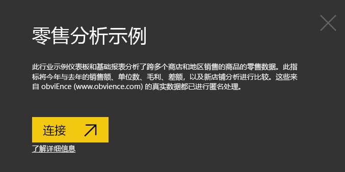
   
5. Power BI 导入内容包，并将新的仪表板、报表和数据集添加到当前工作区。 新的内容会以黄色星号标记。 
   
   
  
### 获取 .pbix 文件形式的此示例

也可以将此示例下载为 .pbix 文件，这是专为 Power BI Desktop 量身定制的文件格式。 

 * [零售分析示例](http://download.microsoft.com/download/9/6/D/96DDC2FF-2568-491D-AAFA-AFDD6F763AE3/Retail%20Analysis%20Sample%20PBIX.pbix)

### 获取 Excel 工作簿形式的此示例
还可以针对此示例[仅下载该数据集（Excel 工作簿）](http://go.microsoft.com/fwlink/?LinkId=529778)。 该工作簿包含你可以查看和修改的 Power View 工作表。 若要查看原始数据，请选择“Power Pivot”>“管理”。

## 启动仪表板并打开报表
1. 在仪表板上，选择“总商店数”磁贴：

   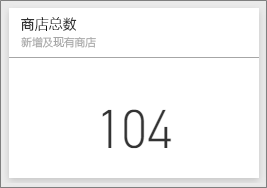  

   此时，会转到报表中的“商店销售额概述”页面。 你会看到我们总共有 104 家商店，其中 10 家为新店铺。 我们有两个供应链，Fashions Direct 和 Lindseys。 Fashions Direct 商店平均面积要大一些。
2. 在饼图中，选择“Fashions Direc”。

   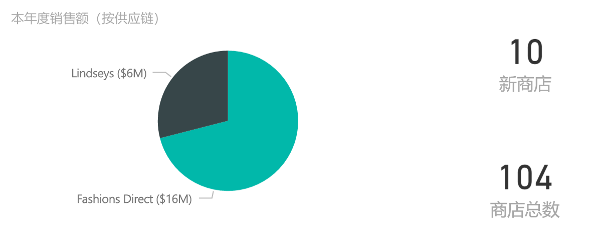  

   请注意气泡图中的结果：

   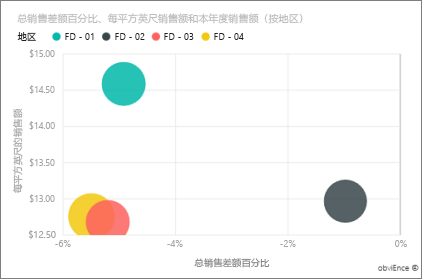  

   FD-01 地区每平方英尺的平均销售额最高，FD-02 与去年相比销售额方差最低，FD-03 和 FD-04 总体绩效最差。
3. 选择单个气泡或其他图表以查看交叉突出显示，从而透露你选择的影响。
4. 若要返回到仪表板，请从顶部导航栏（痕迹导航）中选择其名称。

   
5. 在仪表板上，选择具有“本年度销售额”的磁贴。

   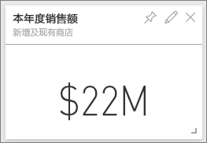

   这相当于在问题框中键入“本年度销售额”。

   你会看到如下屏幕：

   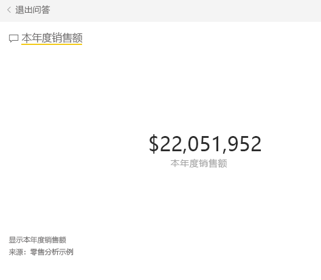

## 查看使用 Power BI 问答创建的磁贴
我们将更具体地进行说明。

1. 将“**按地区**划分本年度销售额”添加到问题中。 观察结果：它会自动将答案放在条形图中，并建议其他短语：

   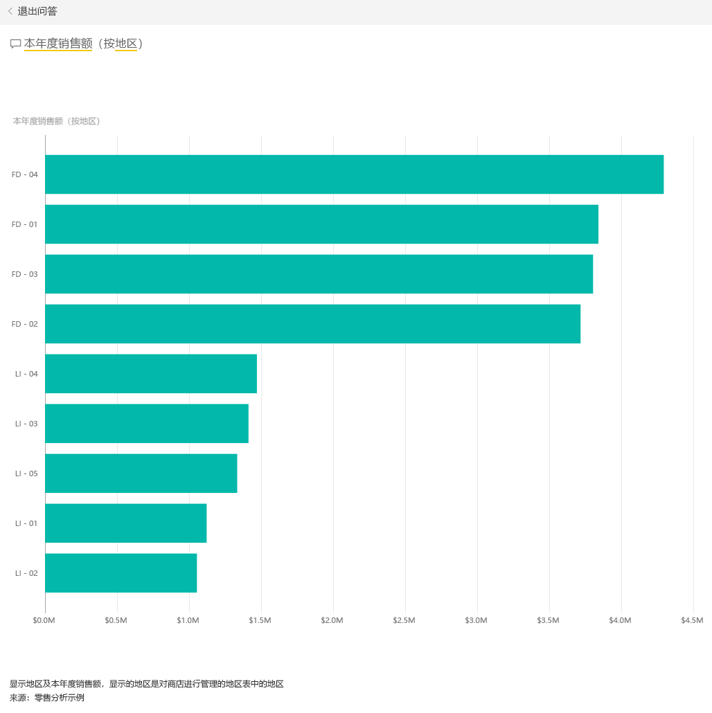
2. 现在，将问题更改为“**按邮编和供应链**划分本年度销售额”。

   注意你采用相应图表键入时问题答案有何不同。
3. 浏览更多问题并查看所获得的结果类别。
4. 准备好后，返回到仪表板。

## 深入了解数据
现在，让我们更详细地浏览下结果，了解下各地区的绩效。

1. 在仪表板上，选择将本年度销售额与去年作比较的磁贴。

   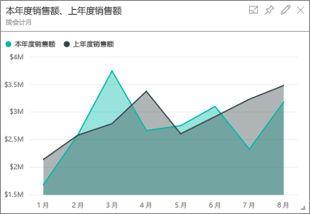

   请注意与去年相比最大的方差变化，1 月、4 月和 7 月尤其差。

   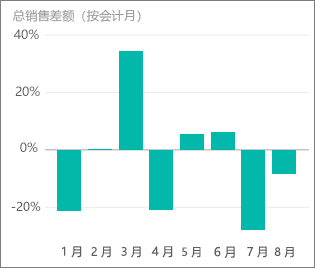

   我们来看看是否可以缩小问题范围。
2. 选择气泡图，然后选择“020-男性”。

   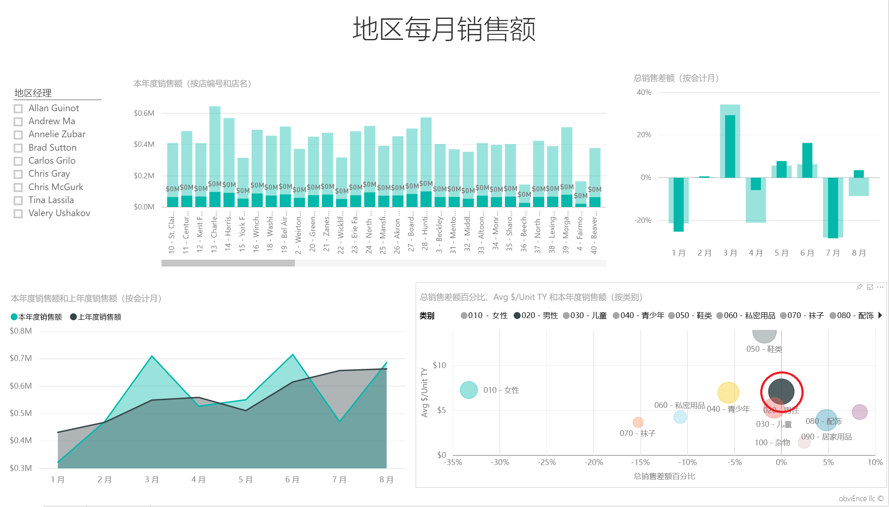  

   观察到男性类别在 4 月的影响不如整体业务严重，但是 1 月和 7 月仍是问题月。
3. 现在，选择“010-女性气泡”。

   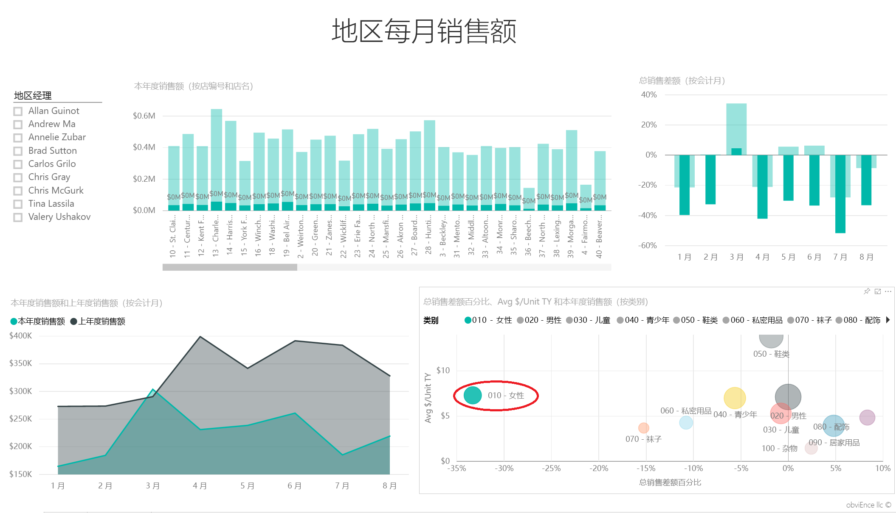

   注意，女性类别在所有月份的表现都比整体业务糟糕许多，并且与去年相比，几乎每个月都更糟。
4. 再次选择气泡以清除筛选器。

## 尝试切片器
让我们来看看具体地区的情况。

1. 在左上角的切片器中选择 Allan Guinot。

   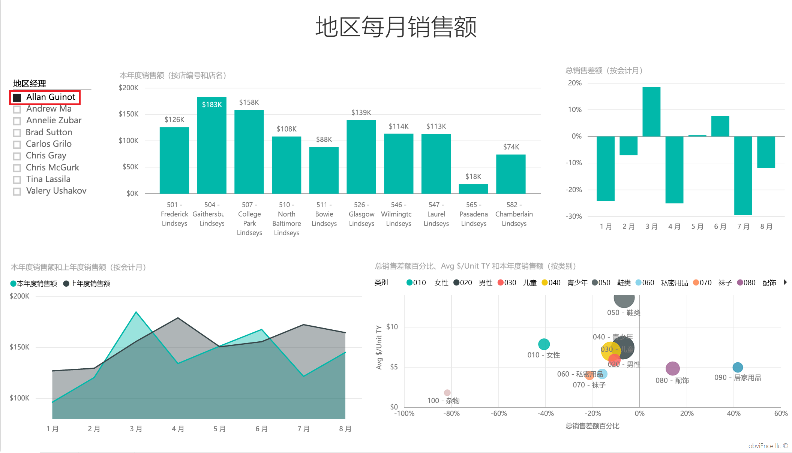

   注意，Allan 地区在 3 月 和 6 月的表现都超过去年。
2. 现在，虽然仍选择 Allan，请选中女性的气泡。

   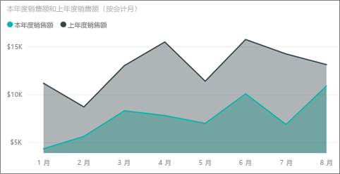

   注意，对于女性的类别，他所负责的地区始终未达到去年的量。
3. 探索其他地区经理和类别，可以发现其他什么见解？
4. 准备好后 – 返回到仪表板。

## 数据显示本年度的销售增长是怎样的？
我们最不想了解的就是增长 – 今年新开了很多商店。

1. 选择“今年开业的商店”磁贴。

   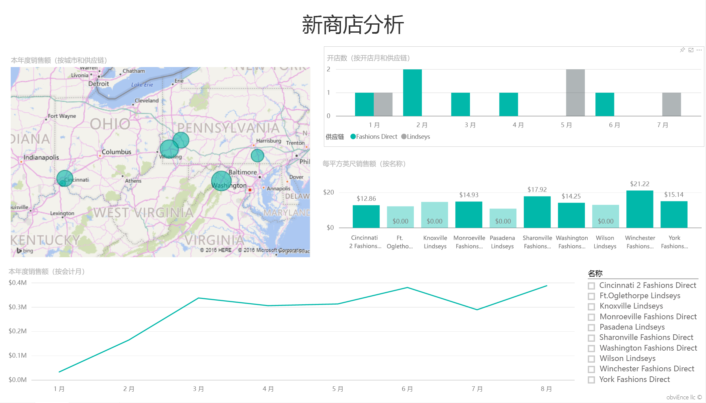

   显而易见 – 今年开业的 Fashions Direct 商店比 Lindseys 商店多。
2. 观察“按名称划分每平方英尺的销售额”图表：

   

    新商店中每平方英尺的平均销售额有很大差异。
3. 在右下角的图表中单击 Fashions Direct 图例项。 注意，即使针对同一个供应链，最好的商店 (Winchester Fashions Direct) 表现明显比最差的商店 (Cincinnati 2 Fashions Direct) 要好，分别是 21.22 美元与 12.86 美元。

   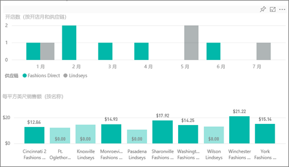
4. 在切片器中单击 Winchester Fashions Direct，观察折线图。 2 月份报告的第一批销售数字。
5. 在切片器中单击 Cincinnati 2 Fashions Direct，你将会在折线图中看到它于 6 月开业，似乎是表现最不好的店。
6. 和前面一样，通过单击图表中的其他条、线和气泡来了解情况，看看你能发现什么见解。

这是一个安全的试验环境。 你可以始终选择不保存所做的更改。 但是，如果保存更改，则可以始终转到“获取数据”来获得本示例的新副本。

## 连接到数据
我们希望本教程已经演示 Power BI 仪表板、问题解答和报表如何能够帮助深入了解零售数据。 现在轮到你了 — 连接到你自己的数据 借助 Power BI，你可以连接到各种数据源。 了解 [Power BI 入门](service-get-started.md)的详细信息。

## 后续步骤
* [下载零售分析示例内容包](sample-tutorial-connect-to-the-samples.md)
* [下载所有示例文件的 zip 文件](http://go.microsoft.com/fwlink/?LinkId=535020)    
* [下载此 Power BI 示例的 Excel 工作簿](http://go.microsoft.com/fwlink/?LinkId=529778)    
* [获取 Power BI 的数据](service-get-data.md)    
* [Power BI - 基本概念](service-basic-concepts.md)    
* 更多问题？ [尝试参与 Power BI 社区](http://community.powerbi.com/)
