# 管理 Power BI Premium 和 Power BI Embedded 中的容量
了解如何管理为内容提供专用资源的 Power BI Premium 和 Power BI Embedded 容量。

容量是 Power BI Premium 和 Power BI Embedded 产品/服务的重中之重。

## 什么是容量？
容量是保留以供专门使用的资源集。 拥有容量后，可向整个组织内的用户发布仪表板、报表和数据集，而无需为他们购买许可证。 还可保证容量中的内容具有稳定可靠的性能。

容量对最终用户完全透明。 用户将继续照常使用 Power BI 或应用程序。 无需知道部分（或全部）内容托管在专用容量中。 对于用户而言，一切都完全像以前那样运行。

[!INCLUDE [powerbi-premium-illustration](./includes/powerbi-premium-illustration.md)]

有关详细信息，请参阅[什么是 Power BI Premium？](service-premium.md)。

## 购买容量
若要利用专用容量，需要在 Office 365 管理中心内为 Power BI Premium 购买订阅，或在 Microsoft Azure 门户中创建 Power BI Embedded 资源。 有关详细信息，请参阅以下内容：

* Power BI Premium：[如何购买 Power BI Premium](service-admin-premium-purchase.md)
* Power BI Embedded：即将推出。

在购买 Power BI Premium SKU 后，租户将收到相应数量的 V 核心，用于运行容量。 例如，购买 Power BI Premium P3 SKU 会为租户提供 32 个 V 核心。

## 容量管理员
> [!NOTE]
> 在 Microsoft Azure 门户中定义 Power BI Embedded 容量的容量管理员。
> 
> 

被指定为容量的容量管理员时，可以完全控制容量及其管理功能。 可以从 Power BI 管理门户添加更多的容量管理员（仅限 Power BI Premium）或为用户授予容量分配权限。 可以为容量批量分配工作区，还可以查看容量的使用情况指标。

每个容量都有自己的管理员。 定义一个容量的容量管理员并不意味着授予他们访问你组织中所有容量的权限。 默认情况下，容量管理员无权访问 Power BI 管理员权限范围内的所有内容，如使用情况指标、审核日志或租户设置。 同样，容量管理员也无权设置新的容量或更改现有容量的 SKU。 只有全局管理员或 Power BI 服务管理员有权访问这些项。

所有 Office 365 全局管理员和 Power BI 管理员都会自动成为 Power BI Premium 容量和 Power BI Embedded 容量的容量管理员。

## 管理容量
在 Office 365 中购买容量节点后，需要设置新容量。 此操作通过 [Power BI 管理门户](service-admin-portal.md)完成。 在管理门户中，将看到“容量设置”部分。 你将在此为组织管理 Power BI 高级容量。

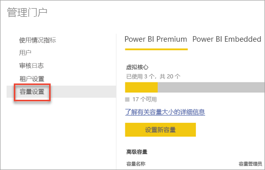

对 Power BI Premium 而言，选择“容量设置”将默认转到容量管理屏幕。

### 设置新容量 (Power BI Premium)
V 核心数将反映使用量以及可用于创建容量的数量。 可供组织使用的 V 核心数量取决于所购买的 高级 SKU。 例如，购买 P3 和 P2 将获得 48 个可用核心，其中 32 个核心来自 P3，16 个核心来自 P2。

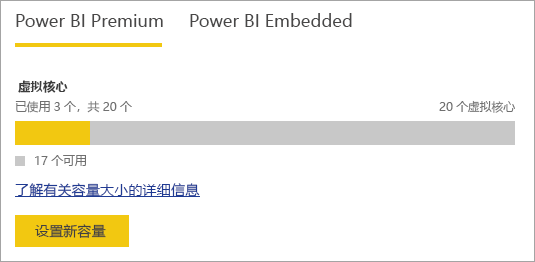

如果有可用的 V 核心，可通过执行以下操作设置新容量。

1. 选择“设置新容量”。
2. 为容量命名。
3. 定义此容量的容量管理员。
   
    容量管理员不需要是 Power BI 管理员或 Office 365 全局管理员。有关详细信息，请参阅 [Power BI 高级容量管理员](#capacity-admins)
4. 选择容量大小。 可用选项取决于拥有的可用 V 核心数。 无法选择大于拥有的可用核心数的选项。
   
    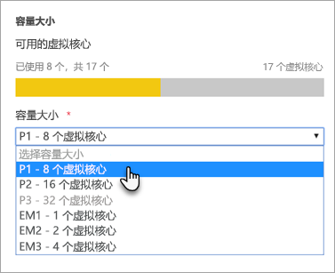
5. 选择“设置”。

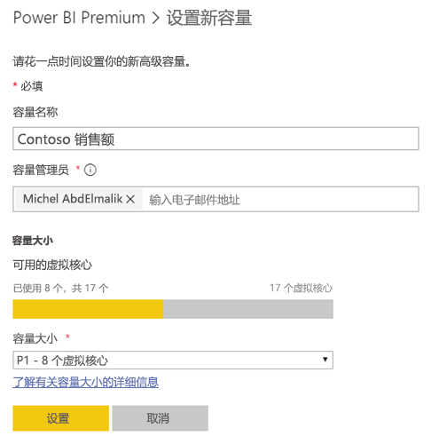

容量管理员以及 Power BI 管理员和 Office 365 全局管理员随后将看到该容量在管理门户中列出。

### 容量设置
在高级容量管理屏幕中，可以在操作中选择“齿轮图标（设置）”。 可通过它重命名或删除容量。 它还将显示服务管理员名单、容量的SKU/大小以及该容量所在的区域。

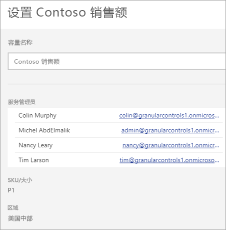

> [!NOTE]
> 在 Microsoft Azure 门户中管理 Power BI Embedded 容量设置。
> 
> 

### 更改容量大小 (Power BI Premium)
Power BI 管理员和 Office 365 全局管理员通过选择“更改容量大小”来更改 Power BI Premium 容量大小。 如果容量管理员不是 Power BI 管理员或 Office 365 全局管理员，将无法使用此选项。

通过“更改容量大小”屏幕，可以升级或降级容量大小（如果有可用的资源）。 只要管理员具有必需的 V 核心数，他们就可以创建节点、调整节点大小和删除节点。 

无法将 P SKU 降级至 EM SKU。 可以将鼠标悬停在提供说明的禁用选项上。

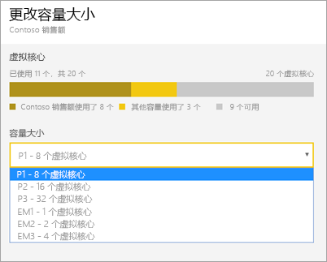

### 容量分配
可以通过选择一个容量名称来管理该容量。 此操作将使你转到容量管理屏幕。

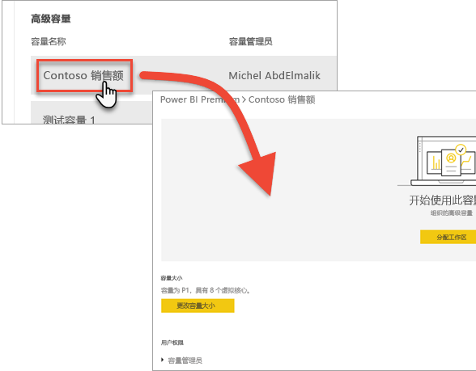

如果没有给该容量分配工作区，将看到一条允许“分配工作区”的消息。

#### 用户权限
可以为 Power BI Premium 容量分配其他容量管理员。 还可以分配将拥有容量分配权限的用户。 如果具有分配权限的用户是某个应用工作区的管理员，那么他们可以将该工作区分配给容量。 还可以将个人的“我的工作区”分配给容量。 具有分配权限的用户不能访问管理门户。

> [!NOTE]
> 对于 Power BI Embedded 容量，在 Microsoft Azure 门户中分配容量管理员。
> 
> 

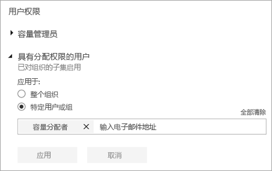

## 使用情况度量 (Power BI Premium)
对于每个容量，你都能使用 CPU、内存和直接查询的使用情况度量。 每个 KPI 都具有三个指标，**“良好（绿色）”****“饱和（黄色）”**和**“严重（红色）”**。 我们建议监测这些指标，确保用户在使用高级内容时保持良好的性能。

**在 Azure 门户中监视 Power BI Embedded 容量的使用情况。**

| 指标 | 说明 |
| --- | --- |
| CPU |核心的 CPU 使用情况。 |
| 内存 |表示后端核心的内存压力。 具体而言，这一指标指示因使用多个模型产生的内存压力，而从内存清除模型的频率。 |
| DQ/秒 |* 我们限制 DirectQuery 的总数和每秒实时连接查询数。 * 限制如下：P1、P2、P3 分别为 30/s、60/s 和 120/s。 * DirectQuery 和实时连接查询和上述限制同样重要。 例如，如果一秒内有 15 个 DirectQueries 和 15 次实时连接，则达到限制。 * 这同样适用于本地连接和云连接。 |

这些指标达到饱和/严重时，你的用户可能会发现报表和刷新性能下降，尤其在负载峰值期间。

指标反映过去一周的使用情况，在容量过载时对实例计数，因此向用户提供的性能可能不太理想。

“使用率超过 80%”中的每一项都应被视为性能下降的潜在事例。 事例过多是能够较好预示用户重大性能问题的一个指标。

## 将工作区分配到容量
有几种方式可以将工作区分配到容量。

### 管理门户中的容量管理
容量管理员以及 Power BI 管理员和 Office 365 全局管理员，可以在管理门户中的高级容量管理部分批量分配工作区。 管理一个容量时，将看到“工作区”部分，可在此进行工作区分配。

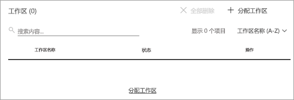

1. 选择“分配工作区”。 这列在多个位置，并执行相同的任务。
2. 选择“整个组织的工作区”或“按用户分配的特定工作区”。
   
   | 所选内容 | 说明 |
   | --- | --- |
   | 整个组织的工作区 |将整个组织的工作区分配到高级容量，会把组织中的所有“应用工作区”和“我的工作区”分配到这个高级容量。 此外，当前和未来的所有用户都将有权向此容量重新分配个别工作区。 |
   | 按用户分配的特定工作区 |按用户或按组分配工作区时，这些用户拥有的所有工作区都将被分配到高级容量，包括用户的个人工作区。 所述的用户自动获得工作区分配权限。 包括已分配到不同容量的工作区。 |
3. 选择**应用**。

此选项不允许向容量分配特定工作区。

### 应用工作区设置
还可以从某个应用工作区的设置中将该应用工作区分配到高级容量。 若要为高级容量分配一个应用工作区，请执行以下操作。

若要将工作区移入容量，必须具备该工作区的管理员权限以及该容量的容量分配权限。 请注意，工作区管理员始终可以从高级容量中删除工作区。

1. 通过选择“省略号 (...)”和“编辑工作区”，编辑一个应用工作区。
   
    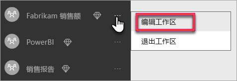
2. 在“编辑工作区”内，展开“高级”。
3. 如果已获得对任何容量的容量分配权限，可以选择为这个工作区开启“高级”。
4. 选择希望将此应用工作区分配到哪个容量。
   
    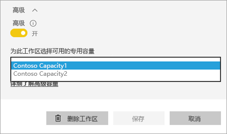
5. 选择**保存**。

保存后，工作区及其所有内容都会被迁移到高级容量，这不会影响最终用户的任何体验。

## 高级容量的用户体验
大多数情况下，用户甚至不需要知道他们处于高级容量中。 其仪表板和报表还会正常工作。 作为一个可视化提示，你将看到高级容量中的工作区旁有一个的菱形图标。 

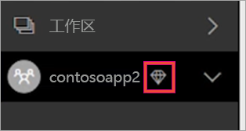

## Power BI 报表服务器产品密钥
在 Power BI 管理门户中的“容量设置”选项卡中，可以访问 Power BI 报表服务器产品密钥。 这将仅适用于全局管理员或分配有 Power BI 服务管理员角色的用户，且前提是购买了 Power BI Premium SKU。

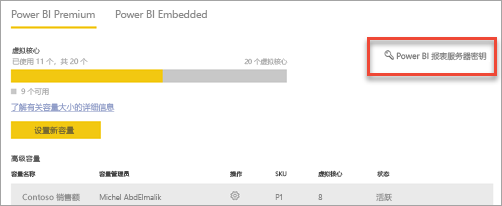

选择“Power BI 报表服务器密钥”将显示包含产品密钥的对话框。 可以复制该密钥并用来进行安装。

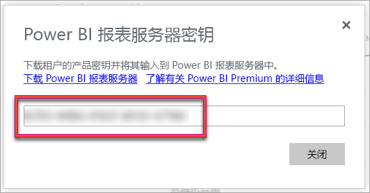

有关详细信息，请参阅[安装 Power BI 报表服务器](report-server/install-report-server.md)。

## 后续步骤
将工作区中分配给高级容量时，与免费用户共享已发布的应用。 有关详细信息，请参阅[在 Power BI 中创建和分发应用](service-create-distribute-apps.md)。

更多问题？ [尝试咨询 Power BI 社区](http://community.powerbi.com/)

