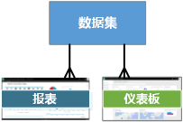

# Power BI - Power BI 服务的基本概念
<!-- Shared newnav Include -->
[!INCLUDE [newnavbydefault](./includes/newnavbydefault.md)]

本文假设你已[注册 Power BI](service-self-service-signup-for-power-bi.md)，且[已添加了一些数据](service-get-data.md)。

打开 Power BI 服务后，将看到显示一个***仪表板***。 仪表板可以区分 Power BI 服务和 Power BI Desktop。

Power BI 服务 UI 的主要功能如下：

1. 导航栏
2. 包含磁贴的仪表板
3. 问题解答问题框
4. 帮助和反馈按钮
5. 仪表板标题
6. Office 365 应用程序启动程序
7. Power BI 主页按钮
8. 其他仪表板操作

我们稍后将深入了解这些操作，不过首先让我们了解一些 Power BI 概念。

或者，你可能想要在阅读本文的剩余部分前先观看该视频。  在视频中，Will 回顾基本概念并提供 Power BI 服务的教程。

<iframe width="560" height="315" src="https://www.youtube.com/embed/B2vd4MQrz4M" frameborder="0" allowfullscreen></iframe>

## Power BI 概念
Power BI 的 3 的主要构建块：仪表板、报表和数据集。 仪表板或报表不能没有数据（嗯，你可以有空仪表板和空报表，但是必须具有数据，它们才会有用），因此，让我们先来了解一下数据集吧。

## 数据集
数据集是导入或连接到的数据集合。 通过 Power BI，你可以连接到并导入各种类型的数据集并将它们组合在一起。  

在导航栏中，你已连接到或导入的数据集列在“数据集”标题下。 每个列出的数据集表示一个数据源，例如，OneDrive 上的 Excel 工作簿，或本地 SSAS 表格数据集或 Salesforce 数据集。 支持许多不同的数据源，并且我们一直在添加新的数据源。 [请参阅可与 Power BI 一起使用的数据集类型列表](service-get-data.md)。

**一个**数据集...

* 可以反复使用。
* 可以用于许多不同的报表。
* 可以在许多不同的仪表板上显示该数据集的可视化对象。
  
  

若要[连接到或导入数据集](service-get-data.md)，请选择“获取数据”（导航栏底部）或者选择“数据集”标题旁边的加号图标。 按照说明连接到或导入特定的源并将该数据集添加到你的工作区。 新的数据集列于左侧导航栏中，并用黄色星号标记。 你在 Power BI 中所做的工作不会更改基础数据集。

如果你是[应用工作区的一部分](service-collaborate-power-bi-workspace.md)，一个工作区成员添加的数据集也可供其他工作区成员使用。

可以刷新、重命名、浏览和删除数据集，也可以使用数据集来创建报表。 若要浏览数据集，请选择数据集。 你实际执行的操作是在报表编辑器中打开数据集，在报表编辑器中，你可以真正开始深入了解数据并创建可视化对象。 那么，我们进入下一个主题 -- 报表。

### 深入了解：
* [Power BI Premium 有哪些特权？](service-premium.md)
* [获取 Power BI 的数据](service-get-data.md)
* [Power BI 的示例数据集和内容包](sample-datasets.md)

## 报表
Power BI 报表是一页或多页可视化效果（折线图、饼图、树状图等图表和图形）。 可视化效果也称为视觉对象。 报表中所有可视化对象来自单个数据集。 可以在 Power BI 中从头开始创建报表，可以使用同事与你共享的仪表板导入报表，还可以当你从 Excel、Power BI Desktop、数据库、SaaS 应用程序和[内容包](service-organizational-content-pack-introduction.md)连接到数据集时创建报表。  例如，当你连接到包含 Power View 表的 Excel 工作簿时，Power BI 将基于这些表创建报表。 当连接到 SaaS 应用程序时，Power BI 将导入预先构建的报表。

有 2 种模式可用来查看报表并与之交互：[阅读视图](service-report-open-in-reading-view.md)和[编辑视图](service-interact-with-a-report-in-editing-view.md)。  只有创建报表的人员、共同所有者以及被授权的那些人员有权访问该报表编辑视图的所有浏览、设计、构建和共享功能。 他们共享报表的对象可以使用阅读视图了解报表并与之进行交互。   

在导航窗格中，报表列在“报表”标题下。 每个列出的报表代表基于其中一个基础数据集的一页或多页可视化对象。 若要打开报表，只需选择报表即可。 默认情况下，报表将先在阅读视图中打开。  只需选择“编辑报表”即可将其在编辑视图下打开（如果你具备必要的权限）。  如果共享仪表板具有报表，你不会看到在导航栏中列出报表。 相反，通过选择仪表板磁贴直接从共享的仪表板中打开共享报表（稍后会更详细地进行介绍）。

**一个**报表...

* 可以与多个仪表板关联（从该报表固定的磁贴可以显示在多个仪表板上）。
* 可以使用来自一个数据集的数据进行创建。 （一个小例外是 Power BI Desktop 可以将多个数据集组合到一个报表中，该报表可以导入到 Power BI）
  
  

## 仪表板
你可以创建仪表板，或者由同事创建仪表板并与你共享。 它是一个画布，其中包含零个或多个磁贴和小组件。 每个磁贴显示通过数据集创建并固定到仪表板的单个[可视化对象](power-bi-report-visualizations.md)。 有多种方法可将磁贴添加到仪表板中，本概述主题中将会介绍很多。 若要了解详细信息，请参阅 [Power BI 中的仪表板磁贴](service-dashboard-tiles.md)。 

在导航栏中，“你的”仪表板列在“仪表板”标题下。 “你的”意味着你具有这些仪表板的访问权限，但不一定是由你创建。 每个仪表板代表一个自定义视图，其中包含一些基础数据集子集。  如果你是仪表板所有者，还将具有基础数据集访问权限，并且这些数据集将显示在导航栏的“数据集”下。  如果与你共享仪表板，在仪表板旁边会有一个共享图标 ，并且根据共享的方式，你可能会看到导航栏中列出基础数据集，也可能看不到。

> [!NOTE]
> “包含磁贴的仪表板”标题下更详细地介绍了固定和磁贴。
> 
> 

**一个**仪表板...

* 可以显示来自许多不同数据集的可视化对象
* 可以显示来自许多不同报表的可视化对象
* 可以显示在其他工具（例如 Excel）中固定的可视化对象
  
  

### 深入了解：
仪表板可以**[从头开始创建](service-dashboard-create.md)** -创建新的空白仪表板，然后获取一些数据。 

你或同事可以创建仪表板并**[进行共享](service-share-dashboards.md)** -当你接受邀请后，共享仪表板（以及任何关联的报表和数据集）会添加到导航栏中。 共享仪表板和查看共享仪表板都需要 Power BI Pro。

**有时，仪表板中会导入数据集，或者在连接到数据集时进行创建**。 例如，Salesforce 的“获取数据”向导将询问你是否愿意从数据集创建仪表板和/或报表。 

人们为什么创建仪表板？  下面只是其中一些原因：

* 为了快速查看做出决策所需的所有信息
* 为了监视有关其业务的最重要的信息
* 为了确保同一页面上的所有同事均查看和使用相同的信息
* 为了监视业务、产品、业务部门或市场营销活动的运行状况。
* 为了创建更大仪表板的个性化视图（所有指标对我都很重要）

## 我的工作区
我们已返回到你的 Power BI 仪表板和工作区。 让我们仔细了解构成 Power BI 服务登陆页面的各部分。

### 1.导航栏 (navbar)
使用导航栏在 Power BI 构建块之间进行移动 ：仪表板、报表和数据集。  

  

* 选择“获取数据”，以[将数据集、报表和仪表板添加到 Power BI](service-get-data.md)。
* 使用此图标  展开和折叠导航栏。
* 使用“搜索”在导航栏中查找特定项目。
* 选择加号图标  来创建新仪表板或获取新的数据集。
* 列出的仪表板、报表以及数据集可供你使用。  共享仪表板为只读仪表板，并会显示共享图标 。
* 仪表板、报表和数据集名称通常与基础数据集文件的名称相匹配，但你可以[对它们重命名](service-rename.md)。
* 右键单击仪表板、报表或数据集以显示上下文相关菜单。 
  
  

单击

* 标题可折叠或展开标题
* 仪表板可显示仪表板
* 报表可在阅读视图中打开报表
* 数据集可浏览数据集

### 2.**包含磁贴的仪表板**
仪表板由[磁贴](service-dashboard-tiles.md)组成。  磁贴在报表编辑视图、问答和其他仪表板中创建，并且可从 Excel、SSRS 等应用中进行固定。 称为[小组件](service-dashboard-add-widget.md)的特殊类型的磁贴将直接添加到仪表板中。 显示在仪表板上的磁贴是由报表创建者/所有者专门放在仪表板上的。  向仪表板添加磁贴的操作称为固定。

有关详细信息，请参阅仪表板（上述）。

### 3.问题解答问题框
浏览你数据的一种方法是提出问题并让 Power BI 问题与解答为你提供答案（采用可视化对象的形式） 问题与解答不能用于向报表添加内容，只能以磁贴的形式将内容添加到仪表板中。

问题与解答会在连接到仪表板的数据集中查找答案。  已连接的数据集是至少有一个磁贴固定到仪表板的数据集。

开始键入问题后，问题与解答将带你进入问题与解答页面。 键入时，问题与解答将帮助你询问相应的问题并通过改换、自动填充、建议以及更多功能来查找最佳答案。 当你拥有想要的可视化对象（答案）时，将其固定到仪表板中。 有关详细信息，请参阅 [Power BI 中的问题与解答](service-q-and-a.md)。

### 4.全屏、通知、设置、下载、帮助和反馈
右上角的图标是你进行设置、获取通知、下载内容、帮助以及向 Power BI 团队提供反馈的资源。 选择双箭头以全屏 模式打开仪表板。  

### 5.仪表板标题（又称为哪个仪表板处于活动状态？）
判断出哪个仪表板处于活动状态并不总是那么容易。  仪表板标题在以下情况下显示：显示在仪表板视图页面中、显示在问题与解答页面中、显示在报表编辑视图和报表阅读视图中以及当你打开数据集时。   

### 6.Office 365 应用启动程序
应用启动程序旨在帮助你使用 Office 365 应用。

### 7.Power BI 主页
选择此选项可返回你最近查看的仪表板。

   

### 8.选项
工作区的此区域包含用于与仪表板进行交互的图标。  除了“添加磁贴”、“收藏夹”和“共享”外，选择省略号还会显示用于复制、打印和刷新仪表板以及更多操作的选项。

   

## 后续步骤
[Power BI 入门](service-get-started.md)  
[Power BI 视频](videos.md)  
[Power BI Premium 有哪些特权？](service-premium.md)

更多问题？ [尝试咨询 Power BI 社区](http://community.powerbi.com/)

