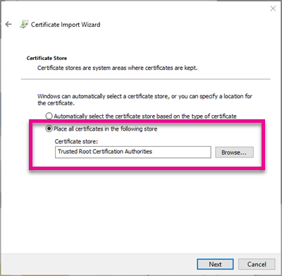
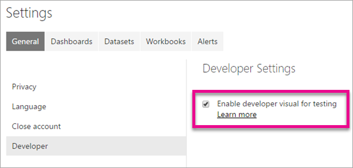

# <a name="use-developer-tools-to-create-custom-visuals"></a>使用开发人员工具创建自定义视觉对象
自定义视觉对象可以满足用户的需求并匹配应用的设计。 了解如何使用开发人员工具为 Power BI 创建自定义视觉对象。

> [!NOTE]
> 可以使用本文档作为入门指导。 有关更深入的信息，请参阅 [Power BI 视觉对象 git 存储库](https://github.com/Microsoft/PowerBI-visuals)中的参考信息。
> 
> 

## <a name="requirements"></a>要求
* 需要 NodeJS 4.0 +（推荐 5.0 或更高版本）[下载 NodeJS](https://nodejs.org)

## <a name="install-nodejs-and-the-power-bi-tools"></a>安装 NodeJS 和 Power BI 工具
若要创建自定义视觉对象，需要安装 NodeJS。 需要使用 NodeJS 运行命令行工具。

1. 下载并安装 [NodeJS](https://nodejs.org)。 需要版本 4.0 或更高版本，但建议使用 5.0 或更高版本。
2. 安装命令行工具。 从命令提示符处运行以下命令。
   
        npm install -g powerbi-visuals-tools
3. 通过运行以下不带任何参数的命令可以确认已安装这些工具。
   
        pbiviz
   
    可以看到以下帮助输出。
   
    <pre><code>
         +syyso+/
    oms/+osyhdhyso/
    ym/       /+oshddhys+/
    ym/              /+oyhddhyo+/
    ym/                     /osyhdho
    ym/                           sm+
    ym/               yddy        om+
    ym/         shho /mmmm/       om+
     /    oys/ +mmmm /mmmm/       om+
    oso  ommmh +mmmm /mmmm/       om+
   ymmmy smmmh +mmmm /mmmm/       om+
   ymmmy smmmh +mmmm /mmmm/       om+
   ymmmy smmmh +mmmm /mmmm/       om+
   +dmd+ smmmh +mmmm /mmmm/       om+
         /hmdo +mmmm /mmmm/ /so+//ym/
               /dmmh /mmmm/ /osyhhy/
                 //   dmmd
                       ++
   
       PowerBI Custom Visual Tool
   
    Usage: pbiviz [options] [command]
   
    Commands:
   
    new [name]        Create a new visual
    info              Display info about the current visual
    start             Start the current visual
    package           Package the current visual into a pbiviz file
    update [version]  Updates the api definitions and schemas in the current visual. Changes the version if specified
    help [cmd]        display help for [cmd]
   
    Options:
   
    -h, --help      output usage information
    -V, --version   output the version number
    --install-cert  Install localhost certificate
    </code></pre>

<a name"ssl-setup"></a>

### <a name="server-certificate-setup"></a>安装服务器证书
若要启用视觉对象的实时预览，需要安装受信任的 https 服务器。 在开始之前，需要安装一个 SSL 证书，以允许在 Web 浏览器中加载视觉对象资产。 

> [!NOTE]
> 这是针对开发人员工作站的一次性安装。
> 
> 

若要添加证书，请运行以下命令。

    pbiviz --install-cert

**Windows 操作系统**

1. 选择“安装证书...”。
   
    
2. 选择“当前用户”，然后选择“下一步”。
   
    
3. 选择“将所有证书放在以下存储”，然后选择“浏览…”。
4. 选择“受信任的根证书颁发机构”，然后选择“确定”。 选择**下一步**。
   
    
5. 选择**完成**。
   
    
6. 在安全警告对话框上选择“是”。
   
    
7. 关闭已打开的任何浏览器。

> [!NOTE]
> 如果未能识别证书，可能需要重启计算机。
> 
> 

**OSX**

1. 如果左上角的锁处于锁定状态，则选择它以解除锁定。 搜索 localhost，并双击该证书。
   
    
2. 选择“始终信任”并关闭窗口。
   
    
3. 输入用户名和密码。 选择“更新设置”。
   
    
4. 关闭已打开的任何浏览器。

> [!NOTE]
> 如果未能识别证书，可能需要重启计算机。
> 
> 

## <a name="enable-live-preview-of-developer-visual"></a>启用开发人员视觉对象的实时预览
若要启用自定义视觉对象的实时预览，请执行以下步骤。 这样可允许编辑报表时在 Power BI 服务中使用视觉对象。

1. 浏览并登录到 [app.powerbi.com](https://app.powerbi.com)。
2. 选择**齿轮图标**，然后选择“设置”。
   
    
3. 选择“开发人员”，然后选择“启用开发人员视觉对象以用于测试”。
   
    
4. 在“可视化效果”窗格中选择“开发人员视觉对象”。
   
    
   
   > [!NOTE]
   > 该操作要求已从开发计算机上的视觉对象文件夹中运行 `pbiviz start`。 有关创建视觉对象的更多信息，请参阅本文中的[创建新的视觉对象](#create-a-new-visual)。
   > 
   > 
5. 在报表画布中选择视觉对象。 可以采用绑定其他视觉对象的方式绑定数据。

现在可以开始开发视觉对象。

## <a name="create-a-new-visual"></a>创建新的视觉对象
可以通过运行以下命令创建新的可视化项目。

```
pbiviz new My Visual name
```

可以将“我的视觉对象名称”替换为要对此视觉对象命名的名称。 稍后可通过修改生成的 `pbiviz.json` 文件中的 `name` 和 `displayName` 字段更改此名称。

此命令在其运行的目录中创建新的文件夹。 此命令为视觉对象生成基本的启动器模板。 完成该命令后，可以打开目录并使用你喜欢的编辑器开始处理新的视觉对象。

## <a name="testing-your-visual-in-power-bi"></a>在 Power BI 中测试视觉对象
可以在 Power BI 服务的报表和仪表板中测试视觉对象。

<a name="running-your-visual"></a>

### <a name="running-your-visual"></a>运行视觉对象
可以通过执行以下操作来运行视觉对象。

1. 打开提示符。
2. 将目录更改为视觉对象文件夹。 这是包含 `pbiviz.json` 文件的文件夹。
3. 运行以下命令。
   
    ```
    pbiviz start
    ```
   
    

如果位于错误的位置，可看到类似于以下内容的错误消息。

```
    error  LOAD ERROR Error: pbiviz.json not found. You must be in the root of a visual project to run this command.
        at e (C:\Users\[user]\AppData\Roaming\npm\node_modules\powerbi-visuals-tools\lib\VisualPackage.js:67:35)
        at Function.loadVisualPackage (C:\Users\[user]\AppData\Roaming\npm\node_modules\powerbi-visuals-tools\lib\VisualPackage.js:62:16)
        at Object.<anonymous> (C:\Users\[user]\AppData\Roaming\npm\node_modules\powerbi-visuals-tools\bin\pbiviz-start.js:43:15)
        at Module._compile (module.js:556:32)
        at Object.Module._extensions..js (module.js:565:10)
        at Module.load (module.js:473:32)
        at tryModuleLoad (module.js:432:12)
        at Function.Module._load (module.js:424:3)
        at Module.runMain (module.js:590:10)
        at run (bootstrap_node.js:394:7)
```

### <a name="viewing-your-visual-in-power-bi"></a>在 Power BI 中查看视觉对象
若要查看报表中的视觉对象，转到该报表，并选择“可视化效果”窗格中的视觉对象。

> [!NOTE]
> 在执行该操作之前必须运行 `pbiviz start` 命令，如[运行视觉对象](#running-your-visual)一节中所述。
> 
> 


之后可以看到视觉对象的启动器模板。


| 工具栏项目 | 说明 |
| --- | --- |
| 刷新视觉对象 |如果禁用了自动重新加载，请手动刷新视觉对象。 |
| 切换自动重新加载 |打开后，每次保存视觉对象文件时自动更新该视觉对象。 |
| 显示数据视图 |显示用于调试的视觉对象的基础数据视图 |
| 获取帮助 |GitHub 中的文档 |
| 发送反馈 |如果有任何可以改善体验的方法，请告诉我们！ （需要 GitHub 帐户） |

## <a name="package-your-visual-for-use-in-power-bi-desktop-and-distribution"></a>将视觉对象打包以用于 Power BI Desktop 和分发版本
将视觉对象加载到 [Power BI Desktop](https://powerbi.microsoft.com/desktop/) 或者在 [Power BI 视觉对象库](https://visuals.powerbi.com)与社区共享视觉对象之前，需要生成 `pbiviz` 文件。

可以通过执行以下操作来打包视觉对象。

1. 打开提示符。
2. 将目录更改为视觉对象文件夹。 这是包含 `pbiviz.json` 文件的文件夹。
3. 运行以下命令。
   
    ```
    pbiviz package
    ```

此命令在视觉对象项目的 `dist/` 目录中创建 `pbiviz`。 如果已经存在 `pbiviz` 文件，将覆盖该文件。

## <a name="updating-the-visuals-api-version"></a>更新视觉对象 API 版本
使用 `pbiviz new` 创建视觉对象时，相应的 API 类型定义和 json 架构的副本被复制到视觉对象的目录。 如果需要，可以使用 `pbiviz update` 命令更新这些文件。 如果我们发布了针对过去的 API 版本的修复，或者你想要更新到最新的 API 版本，此操作很有用。

### <a name="updating-your-existing-api-version"></a>更新现有的 API 版本
如果我们发布了现有 API 的更新，则可以通过执行以下操作来获取最新版本。

```
#Update your version of pbiviz
npm install -g powerbi-visuals-tools

#Run update from the root of your visual project, where pbiviz.json is located
pbiviz update
```

此操作可从包括更新后的类型定义和架构的 npm 中下载最新的工具。 使用 `pbiviz update` 可用最新版本覆盖 pbiviz.json 文件中的 `apiVersion` 属性。

### <a name="upgrading-to-a-different-api-version"></a>升级到不同的 API 版本
可以使用与上述相同的步骤更新到不同的 API 版本。 可以显式指定想要使用的 API 版本。

```
#Update your version of pbiviz
npm install -g powerbi-visuals-tools

#Run update from the root of your visual project, where pbiviz.json is located
pbiviz update 1.2.0
```

此操作将视觉对象更新到 API 版本 1.2.0。 可将 `1.2.0` 替换为想要使用的任何版本。

> [!WARNING]
> 工具所使用的默认 API 版本始终为 API 的稳定版本。 任何晚于默认 API 版本的版本均不稳定且易被更改。 它们可能产生意外的行为，在 Power BI 服务和 Power BI Desktop 中的行为可能不同。 有关当前的稳定 API 版本，请参阅 [change log](https://github.com/Microsoft/PowerBI-visuals/blob/master/ChangeLog.md)（更改日志）。 有关预发行版本的详细信息，请参阅 [roadmap](https://github.com/Microsoft/PowerBI-visuals/blob/master/Roadmap/README.md)（路线图）。
> 
> 

## <a name="inside-the-visual-project"></a>在视觉对象项目内部
视觉对象项目是运行 `pbiviz new` 命令时创建的文件夹。 

### <a name="file-structure"></a>文件结构
| 项 | 说明 |
| --- | --- |
| assets/ |用于存储视觉对象资产（图标、屏幕截图等）。 |
| dist/ |运行 `pbiviz package` 时，在此处生成 pbiviz 文件。 |
| src/ |视觉对象的 Typescript 代码。 |
| style/ |视觉对象的 Less 样式。 |
| .gitignore |告知 git 忽略不应在存储库中跟踪的文件。 |
| capabilities.json |用于定义视觉对象的[功能](https://github.com/Microsoft/PowerBI-visuals/blob/master/Capabilities/Capabilities.md)。 |
| package.json |供 [npm](https://www.npmjs.com/) 用于管理模块。 |
| pbiviz.json |主配置文件。 |
| tsconfig.json |Typescript 编译器设置。 了解有关 [tsconfig.json](https://www.typescriptlang.org/docs/handbook/tsconfig-json.html) 的更多信息。 |

### <a name="pbivizjson"></a>pbiviz.json
此文件是视觉对象的主配置文件。 它包含元数据和生成视觉对象所需的文件的信息。

```
{
    "visual": {
        "name": "myVisual", // internal visual name (should not contain spaces)
        "displayName": "My Visual!", // visual name displayed to user (used in gallery)
        "guid": "PBI_CV_xxxxxxx", // a unique id for this visual MUST BE UNIQUE
        "visualClassName": "Visual" // the entry class for your visual
        "version": "1.0.0", // visual version. Should be semantic version (increment if you update the visual)
        "description": "", // description used in gallery
        "supportUrl": "", // url to where users can get support for this visual
        "gitHubUrl": "" // url to the source in github (if applicable)
    },
    "apiVersion": "1.0.0", //API version this visual was created with
    "author": {
        "name": "", // your name
        "email": "" // your e-mail
    },
    "assets": {
        "icon": "assets/icon.png" // relative path to your icon file (20x20 png)
    },
    "style": "style/visual.less", // relative path to your less file
    "capabilities": "capabilities.json" // relative path to your capabilities definition 
}
```

### <a name="visual-source-typescript"></a>视觉对象源 (TypeScript)
应使用 TypeScript 编写视觉对象代码，TypeScript 是 JavaScript 的超集，支持更高级的功能和提前访问 ES6/ES7 功能。

所有 TypeScript 文件应存储在 `src/` 目录中，并添加到 `tsconfig.json` 中的 `files` 数组。 这样，TypeScript 编译器可以按既定的顺序加载这些文件。

生成视觉对象后，所有 TypeScript 被编译为一个 JavaScript 文件。 只要这两个文件在 tsconfig 中列出，此操作允许从其他文件引用导出的元素，而无需手动 `require` 它们。

可以创建尽可能多的文件和类用于创建视觉对象。

了解更多有关 [TypeScript](http://www.typescriptlang.org/) 的详细信息。

### <a name="visual-style-less"></a>视觉对象样式 (Less)
视觉对象样式使用层叠样式表 (CSS) 进行处理。 为方便起见，我们使用 Less 预编译器，该编译器支持某些高级功能，例如嵌套、变量、mixins、条件、循环等。如果不想使用其中任何一种功能，可以只在 Less 文件中编写普通 CSS。

所有 Less 文件应存储在 `style/` 目录中。 将加载 `pbiviz.json` 文件中 `style` 字段下指定的文件。 使用 `@import` 加载任何其他文件。

了解有关 [Less](http://lesscss.org/) 的更多信息。

## <a name="debugging"></a>调试
有关调试自定义视觉对象的提示，请参阅[调试指南](https://github.com/Microsoft/PowerBI-visuals/blob/master/tools/debugging.md)。

## <a name="submit-your-visual-to-appsource"></a>将视觉对象提交到 AppSource
可以通过将视觉对象提交到 AppSource，列出该视觉对象供其他人使用。 有关此过程的详细信息，请参阅[将自定义视觉对象发布到 AppSource](developer/office-store.md)。

## <a name="troubleshooting"></a>故障排除
**找不到 Pbiviz 命令（或类似错误）**

如果在终端/命令行运行 `pbiviz`，可以看到帮助屏幕。 如果没有，则未正确安装。 请确保至少安装了 NodeJS 4.0。

有关详细信息，请参阅[安装 NodeJS 和 Power BI 工具](#install-nodejs-and-the-power-bi-tools)...

**在“可视化效果”选项卡中找不到“调试视觉对象”**

在“可视化效果”选项卡中“调试视觉对象”看上去像一个提示图标。


如果看不到它，请确保已经在 Power BI 设置中启用了它。 

> [!NOTE]
> 目前，调试视觉对象仅可用于 Power BI 服务，不可用于 Power BI Desktop 或移动应用。 打包后的视觉对象仍可用于任何地方。
> 
> 

有关详细信息，请参阅[启用开发人员视觉对象的实时预览](#enable-live-preview-of-developer-visual)...

**无法联系视觉对象服务器**

在终端/命令行中从视觉对象项目的根目录使用命令 `pbiviz start` 运行视觉对象服务器。 如果服务器正在运行，则可能是未正确安装 SSL 证书。

有关详细信息，请参阅[运行视觉对象](#running-your-visual)或[安装服务器证书](#ssl-setup)。

## <a name="next-steps"></a>后续步骤
[Power BI 中的可视化效果](power-bi-report-visualizations.md)  
[Power BI 中的自定义可视化效果](power-bi-custom-visuals.md)  
[将自定义视觉对象发布到 Office 应用商店](developer/office-store.md)  
[TypeScript](http://www.typescriptlang.org/)  
[Less CSS](http://lesscss.org/)  

更多问题？ [尝试咨询 Power BI 社区](http://community.powerbi.com/)

