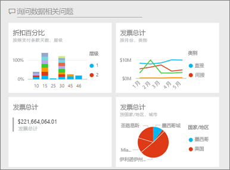
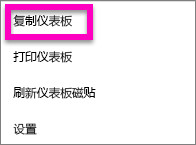
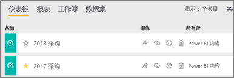

# 创建 Power BI 仪表板的副本

创建所拥有的仪表板的副本有多种原因。 副本将保存到活动（相同）工作区。 你可能想要对原始版本进行更改并测试其性能；或创建由同事、区域或团队分发的略微不同的版本。 可能有某个同事喜欢你的仪表板设计，想要使用它向经理汇报工作。 另一个原因是，可能你具有包含相同数据结构和数据类型的新数据库，并且想要重用已创建的仪表板。这也可以完成，但需要在 Power BI Desktop 中执行一些操作。 

不能复制已作为应用与你共享的仪表板。

1. 打开仪表板。
2. 在右上角选择省略号 (...)，然后选择“复制仪表板”。
   
   
3. 为仪表板命名并选择“复制”。 
   
   
4. 新仪表板将与原始仪表板保存在同一工作区中。 
   
   

## 后续步骤
* [编辑、调整大小和移动磁贴](service-dashboard-edit-tile.md) 
* [设计出色仪表板的提示](service-dashboards-design-tips.md) 

更多问题？ [尝试参与 Power BI 社区](http://community.powerbi.com/)

