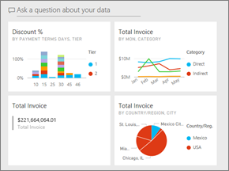
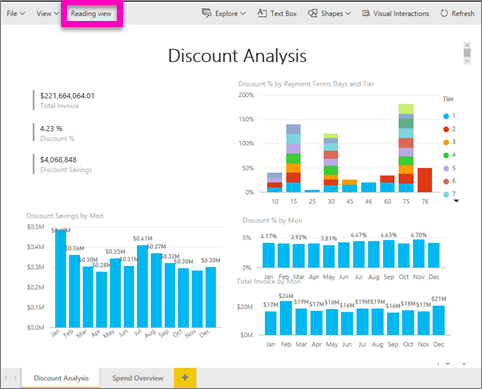
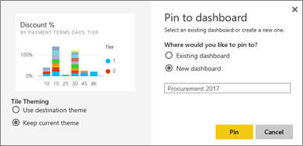
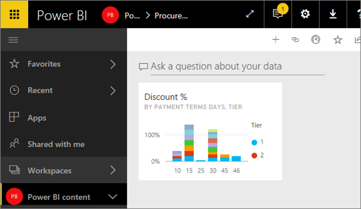
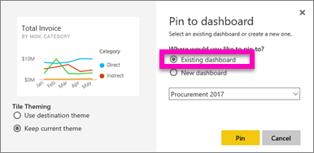

# 从报表创建 Power BI 仪表板
你已经阅读了 [Power BI 中的仪表板](service-dashboards.md)，并且现在想要创建你自己的仪表板。 有许多不同的方法可用于创建仪表板：从报表、从头开始、从数据集、通过复制现有仪表板等。  本主题和视频演示了如何从现有报表中固定可视化效果来创建新仪表板。

> **注意**：仪表板是 Power BI 服务的一项功能，而不是 Power BI Desktop 的功能。 无法在 Power BI 移动设备中创建仪表板，但可以[查看和共享](mobile-apps-view-dashboard.md)仪表板。
> 
> 

## 视频：通过从报表中固定视觉对象和图像创建仪表板
观看 Amanda 通过从报表中固定可视化效果来创建新仪表板。 然后，使用采购分析示例，按照视频下面的步骤亲自尝试一下。

<iframe width="560" height="315" src="https://www.youtube.com/embed/lJKgWnvl6bQ" frameborder="0" allowfullscreen></iframe>

## 使用报表导入数据集
我们将导入一个 Power BI 示例数据集，并使用它来创建我们的新仪表板。 我们使用的示例是包含两个 PowerView 工作表的 Excel 工作簿。 当 Power BI 导入工作簿时，它将向你的工作区添加一个数据集和一个报表。  该报表是从 PowerView 工作表自动创建的。

1. [选择此链接](http://go.microsoft.com/fwlink/?LinkId=529784)下载并保存采购分析示例 Excel 文件。 我们建议你将其保存在你的 OneDrive for Business 中。
2. 在浏览器 (app.powerbi.com) 中打开 Power BI 服务。
3. 选择现有的工作区或新建应用工作区。
4. 从左侧导航窗格中，选择“获取数据”。
   
    
5. 然后，选择“文件”。
   
   
6. 导航到你保存采购分析示例 Excel 文件的位置。 选择它，然后选择“连接”。
   
   
7. 对于此练习，请选择“导入”。
   
    
8. 出现成功消息时，选择 **x** 将其关闭。
   
   

### 打开报表并将一些磁贴固定到仪表板
1. 在同一工作区中，选择“报表”选项卡。新导入的报表显示有黄色星号。 选择报表名称以打开它。
   
    
2. 报表会在[阅读视图](service-reading-view-and-editing-view.md)中打开。 请注意，它的底部包含两个选项卡：折扣分析和支出概况。 每个选项卡表示报表的一页。
   
    
3. 将鼠标悬停在可视化效果上方以显示可用的选项。 要将可视化效果添加到仪表板，请选择固定  图标。
   
    
4. 由于我们正在创建新仪表板，请选择“新建仪表板”选项，并为其指定名称。 
   
   
5. 当你选择“固定”时，Power BI 将在当前工作区中创建新仪表板。 当“已固定到仪表板”消息出现时，选择“转到仪表板”。 如果系统提示你保存报表，请选择“保存”。
   
     
6. Power BI 将打开新的仪表板，其中包含一个磁贴，即我们刚刚固定的可视化效果。 
   
   
7. 要返回到报表，请选择该磁贴。 将更多磁贴固定到新仪表板。 此时，显示“固定到仪表板”窗口，请选择“现有仪表板”。  
   
   

恭喜你创建了第一个仪表板！ 现在你拥有了一个仪表板，通过它你可以执行更多操作。  请尝试执行下面建议的**后续步骤**的任一步骤，或者自己开始操作和探索。   

## 后续步骤
* [调整大小和移动磁贴](service-dashboard-edit-tile.md)
* [关于仪表板磁贴的所有内容](service-dashboard-tiles.md)
* [通过创建应用共享仪表板](service-create-distribute-apps.md)
* [Power BI - 基本概念](service-basic-concepts.md)
* [Power BI 中的仪表板](service-dashboards.md)
* [设计出色仪表板的提示](service-dashboards-design-tips.md)

更多问题？ [尝试参与 Power BI 社区](http://community.powerbi.com/)

