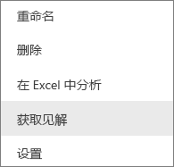
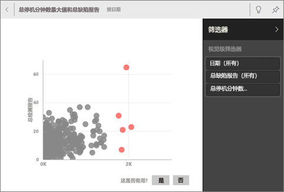
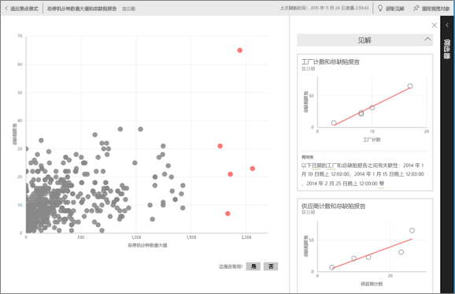
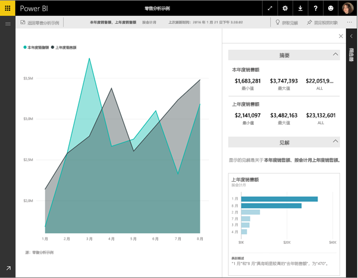

# Power BI 中的 Quick Insights
你有新数据集，但不太确定要从何处着手？  需要快速生成仪表板？  想要快速查找你可能错失的见解？

运行 Quick Insights 便可基于你的数据生成有趣的交互式可视化效果。 你可以对整个数据集运行 Quick Insights (Quick Insights)，也可以对特定仪表板磁贴运行 Quick Insights (Scoped Insights)。 甚至可以在见解上运行快速见解！

> **注意**：快速见解不适用于 DirectQuery，仅适用于上传到 Power BI 的数据。
> 
> 

Quick Insights 功能以一组与 Microsoft Research 联合开发且数量不断增长的[高级分析算法](service-insight-types.md)为基础构建而成，我们将继续通过该功能让更多人以新颖直观的方式从其数据中寻找见解。

## 对数据集运行 Quick Insights
请观看下面的视频，Amanda 将演示如何对数据集生成快速见解，在焦点模式下打开见解，将其中一个快速见解作为磁贴固定到仪表板中，然后为视觉对象获取快速见解。

<iframe width="560" height="315" src="https://www.youtube.com/embed/et_MLSL2sA8" frameborder="0" allowfullscreen></iframe>

现在轮到你了。 使用[供应商质量分析示例](sample-supplier-quality.md)探索快速数据分析。

1. 从“数据集”选项卡中选择省略号 (…) 并选择“获取见解”。
   
    
   
    
2. Power BI 使用[各种算法](service-insight-types.md)来搜索数据集中的趋势。
   
    
3. 你的见解会在几秒内准备就绪。  选择**查看见解**以显示可视化效果。
   
    
   
   > 注意：某些数据集不能生成快速见解，因为数据不具有统计学意义。  若要了解详细信息，请参阅[针对 Quick Insights 优化你的数据](service-insights-optimize.md)。
   > 
   > 
4. 可视化效果会在特殊的“快速见解”画布中显示，最多可包含 32 个不同的见解卡片。 每张卡片会有一个图表或图形，并附上简短的说明
   
    

## 与 Quick Insight 卡片交互
  

1. 将鼠标悬停在某个卡片上，选择固定图标，以将可视化效果添加到仪表板中。
2. 将鼠标悬停在某个卡片上，选择焦点模式图标，以全屏显示卡片。
   
    
3. 在“焦点”模式下，你可以：
   
   * [筛选](service-interact-with-a-report-in-reading-view.md)可视化效果。  若要显示筛选器，请选择右上角的箭头以展开“筛选器”窗格。
     
        
   * 通过选择固定  图标或“固定视觉对象”将见解卡固定到仪表板。
   * 在卡片自身中运行 Quick Insights。 这称为 **Scoped Quick Insights**。 在右上角，选择灯泡图标  或“获取见解”。
     
       
     
     该快速见解显示在左侧，而完全根据该快速见解中的数据获得的新卡片显示在右侧。
     
       
4. 若要返回到最初的 Quick Insights 画布，请在左上角选择“**退出焦点模式**”。

## 对仪表板磁贴运行 Quick Insights
将搜索范围缩小为仅针对用于创建单个仪表板磁贴的数据搜索见解，而不是针对整个数据集搜索见解。 这称为 **Scoped Quick Insights**。

1. 打开仪表板。
2. 选择一个磁贴并[在“焦点”模式下打开磁贴](service-focus-mode.md)。
3. 选择右上角的**获得见解**。
   
    
4. Power BI 将在磁贴右侧显示见解卡片。
   
    
5. 你是否对某个见解产生了兴趣？ 选择该见解卡片以深入进行了解。 选中的快速见解显示在左侧，而完全根据该快速见解中的数据获得的新见解卡片显示在右侧。
6. 继续发掘数据，发现感兴趣的快速见解时，从右上角选择“固定视觉对象”，将其视觉对象固定到仪表板上。 此外，还可以发送反馈，让数据集所有者知道某个快速见解是否有用。
   
    

## 后续步骤
如果你拥有一个数据集，请[对其进行优化以用于 Quick Insights](service-insights-optimize.md)

了解[可用的快速见解的类型](service-insight-types.md)

更多问题？ [尝试参与 Power BI 社区](http://community.powerbi.com/)

