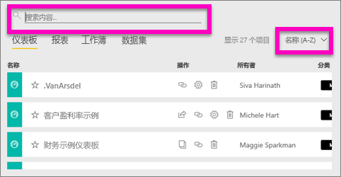
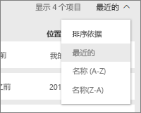

# 对 Power BI 中的内容进行搜索和排序
Power BI 自动组织、用户标记、搜索和排序的组合，可使你在 Power BI 服务中快速找到所需的内容。

## Power BI 如何帮助你导航到你的内容
Power BI 服务通过以下几个方式组织内容。  首先，它将你的内容划分为仪表板、报表、工作簿和数据集。 你将在多个 Power BI 屏幕上看到此组织。 接下来，Power BI 服务对内容进行分类，方便你快捷地找到所需的内容。 下面是左侧导航栏。

创建供自己使用的内容位于“我的工作区”中，你所创建的和与组共享的内容位于“应用工作区”中，你想要快速访问的内容保存在“收藏夹”中，与你共享的内容位于“与我共享的内容”中，而最近访问的内容则显示在“最近访问”中。

有关详细信息，请参阅 [Power BI 服务中的内容组织方式](service-basic-concepts.md)

> **注意**：组织内容的另一种方式是选取一个你希望经常查看的仪表板，并将其设置为你的“精选”仪表板。 每次打开 Power BI 服务时，这将是首先显示的仪表板。 若要了解详细信息，请参阅[精选仪表板](service-dashboard-featured.md)。
> 
> 

## 将仪表板和应用加入收藏夹
你是否有大量经常访问的仪表板和应用？ 通过[将它们设置为“收藏夹”](service-dashboard-favorite.md)，可以始终通过左侧导航栏进行访问。

.

请参阅文章 [Power BI 服务中的收藏夹](service-dashboard-favorite.md)，详细了解如何使用收藏夹。

## 在工作区中进行搜索和排序
工作区包含四个内容选项卡：仪表板、报表、工作簿和数据集。  每个选项卡都包含搜索字段和一个排序按钮。  刚开始使用 Power BI 服务时，可能不易发现它们的用途，因为每个选项卡只有一两个项。但是，随着时间的推移，最终你可能会获得较长的内容列表。  使用搜索和排序可以轻松地查找你需要的内容。

* 输入搜索词在当前屏幕上查找匹配项
  
   
* 选择排序按钮可显示当前页的选项。 这些选项可按名称或所有者进行排序。
  
   

## 注意事项和疑难解答
* 对于数据集，所有者无法使用**排序依据**。

## 后续步骤
[Power BI - 基本概念](service-basic-concepts.md)

更多问题？ [尝试参与 Power BI 社区](http://community.powerbi.com/)

