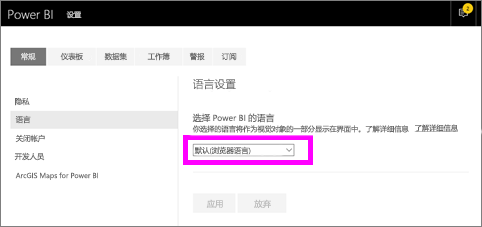
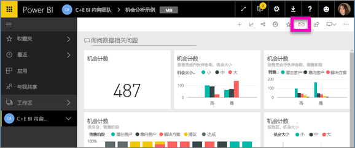
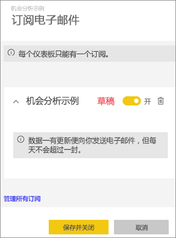
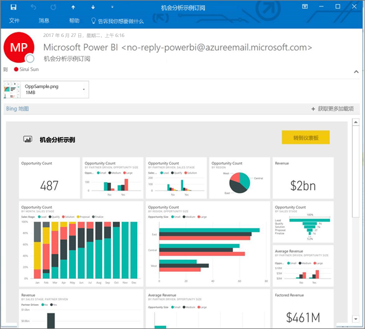
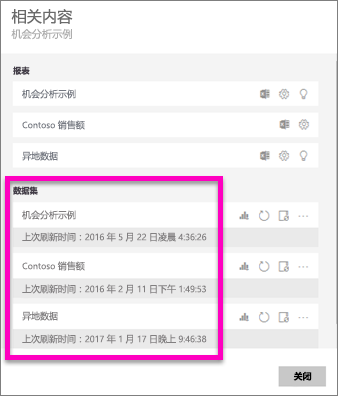
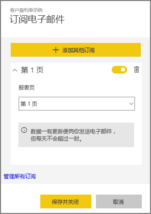
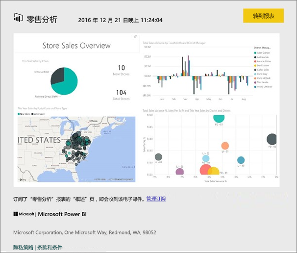
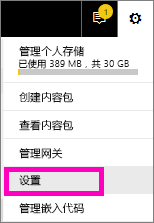
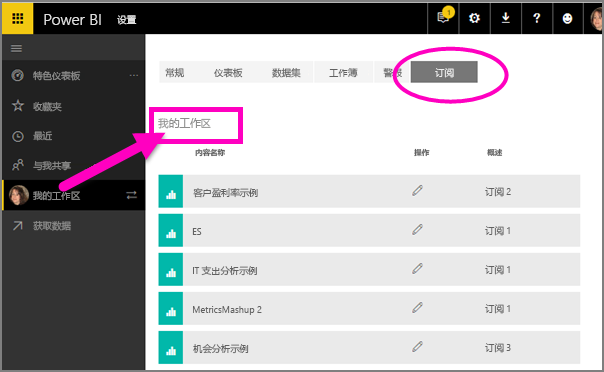

# 订阅 Power BI 报表或仪表板
现在，及时更新最重要的仪表板和报表，比以前更加轻松。 订阅最重要的报表页和仪表板，Power BI 将会通过电子邮件将快照发送到收件箱。 告知 Power BI 所需的电子邮件接收频率：从每天一次到每周一次。 电子邮件和快照将使用 Power BI 设置中设置的语言。 如果未定义任何语言，Power BI 将使用当前的浏览器语言。

若要查看或设置语言首选项，请选择齿轮图标  >“设置”>“常规”>“语言”。

> [!NOTE]
> 只能在 Power BI 服务中创建订阅。 收到的电子邮件中包含“转到报表/仪表板”链接。 在安装了 Power BI 应用的移动设备上，选择此链接将启动应用（而不是执行在 Power BI 网站上打开报表或仪表板这样的默认操作）。
> 
> 

观看 Sirui 如何设置报表的电子邮件订阅。 然后按照视频下面的分步说明来自己尝试一下。

<iframe width="560" height="315" src="https://www.youtube.com/embed/saQx7G0pxhc" frameborder="0" allowfullscreen></iframe>

## 要求
创建订阅是一项 Power BI Pro 功能，必须拥有查看或编辑内容（仪表板或报表）的权限。

## 订阅仪表板

1. 打开仪表板。
2. 在顶部菜单栏中，选择“订阅”或信封图标 。
   
   
3. 使用黄色滑块可启用和禁用订阅。  将滑块设置为“关”不会删除订阅。 若要删除订阅，请选择垃圾桶图标。
   
   
4. 选择“**保存并关闭**”，保存订阅。 每次任意基础数据集发生更改时，你都会收到仪表板的电子邮件快照。 如果仪表板一天刷新多次，只会在首次刷新后收到快照电子邮件。
   
   
   
   > [!TIP]
   > 想立即查看电子邮件？ 刷新一个与仪表板相关联的数据集，从而触发电子邮件。 （如果你没有对数据集的编辑权限，则只能请具有这些权限的人员为你执行此操作。）若要确定创建仪表板使用了哪些数据集，请选择仪表板中的“查看相关内容”图标  打开相关内容，然后选择刷新图标 。 
   > 
   > 
   
   

## 订阅报表页面
1. 在[阅读视图](service-report-open-in-reading-view.md)中打开报表。
2. 在顶部菜单栏中，选择“**订阅**”。
   
   
3. 可以一次订阅一个报表页面。 从下拉列表中选择特定的报表页面。
   
   
   
   继续添加报表页面。
4. 使用黄色滑块可打开和关闭每个页面的订阅。  将滑块设置为“关”不会删除订阅。 若要删除订阅，请选择垃圾桶图标。
   
   
5. 选择“**保存并关闭**”，保存订阅。 此时，如果报表刷新，你就会收到一封包含每个报表页面快照的电子邮件。 如果报表没有刷新，那天你就不会收到快照电子邮件。  如果报表多次刷新，你只会在首次刷新后收到快照电子邮件。
   
   
   
   > [!TIP]
   > 想立即查看电子邮件？ 通过打开数据集并选择“**立即刷新**”来触发电子邮件。 如果你没有对数据集的编辑权限，则你只能要求具有这些权限的人为你执行此操作。
   > 
   > 
   > 
   > 

## 如何确定报表订阅的电子邮件发送计划
下表介绍了你将接收电子邮件的频率。 这完全取决于仪表板或报表依据的数据集的连接方法（DirectQuery、实时连接、导入 Power BI，或 OneDrive/SharePoint Online 中的 Excel 文件），以及可用和已选择的订阅选项（“每日一次”、“每周一次”或“无”）。

|  | **DirectQuery** | **实时连接** | **计划的刷新（导入）** | **OneDrive/SharePoint Online 中的 Excel 文件** |
| --- | --- | --- | --- | --- |
| **报表/仪表板多久刷新一次？** |每 15 分钟 |Power BI 每 15 分钟检查一次，如果数据集已更改，则会刷新报表。 |用户可以选择无、每日或每周。 每日可以一天多达 8 次。 每周实际上是一个每周计划，用户可以创建和设置刷新，少至一周一次，多至每天一次。 |每小时一次 |
| **用户对订阅电子邮件计划有多少控制权？** |选项为：每日或每周 |无选项：如果报表刷新，则向用户发送电子邮件，但每天最多一次。 |如果刷新计划为每日一次，选项为“每日一次”和“每周一次”。  如果刷新计划为每周一次，选项仅为“每周一次”。 |无选项：每当数据集更新时向用户发送电子邮件，但每天最多一次。 |

## 管理订阅
订阅管理屏幕的路径有 2 个。  第一个是选择“**订阅电子邮件**”对话框中的“**管理所有订阅**”（见上述第 3 步）。 第二个是选择顶部菜单栏中的 Power BI 齿轮图标 ，然后选择“**设置**”。

具体显示哪些订阅视当前处于活动状态的工作区而定。  若要一次性查看所有工作区的全部订阅，请确保“**我的工作区**”处于活动状态。 若要了解工作区，请参阅 [Power BI 中的工作区](service-create-distribute-apps.md)。

如果 Pro 许可证已到期、仪表板或报表被所有者删除、用于创建订阅的用户帐户被删除，那么订阅将结束。

## 注意事项和疑难解答
* 暂无法订阅内容包或 Power BI 应用中的仪表板或报表。 不过，解决方法也是有的，就是复制报表/仪表板，再改为订阅相应的版本。
* 对于实时连接数据集上的电子邮件订阅，你只会在数据更改时收到电子邮件。 因此，如果发生刷新但没有数据更改，Power BI 不会向你发送电子邮件。
* 电子邮件订阅不支持大多数[自定义视觉对象](power-bi-custom-visuals.md)。  已经过[认证](power-bi-custom-visuals-certified.md)的自定义视觉对象除外。  
* 电子邮件订阅与报表的默认筛选器和切片器状态一起发送。 你在订阅前对默认设置所做的任何更改都不会显示在电子邮件中。    
* 由 Power BI Desktop 创建的实时连接到服务功能的报表页尚不支持电子邮件订阅。    
* 对于仪表板订阅，具体来说，尚不支持某些类型的磁贴。  其中包括流磁贴、视频磁贴、自定义 Web 内容磁贴。     
* 如果与租户外部的同事共享仪表板，此人将无法订阅仪表板或其关联的报表页。 因此，如果你是 aaron@xyz.com，可以与 anyone@ABC.com 共享内容。不过，anyone@ABC.com 无法订阅共享的内容。    
* 由于电子邮件大小限制，可能无法订阅包含极大图像的仪表板或报表。    
* 如果超过 2 个月一直没有人访问仪表板和报表，那么 Power BI 会自动暂停刷新与它们关联的数据集。  不过，如果添加对仪表板或报表的订阅，即使无人访问，也不会暂停刷新。    
* 如果未收到订阅电子邮件，请确保用户主体名称 (UPN) 能够接收电子邮件。 [Power BI 团队正在努力放宽此要求](https://community.powerbi.com/t5/Issues/No-Mail-from-Cloud-Service/idc-p/205918#M10163)，敬请关注。 

## 后续步骤
* 更多问题？ [尝试咨询 Power BI 社区](http://community.powerbi.com/)    
* [阅读博客文章](https://powerbi.microsoft.com/blog/introducing-dashboard-email-subscriptions-a-360-degree-view-of-your-business-in-your-inbox-every-day/)

