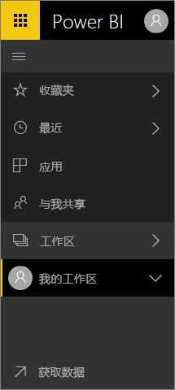
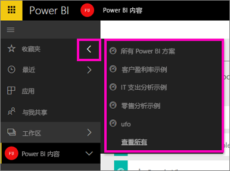
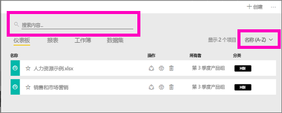
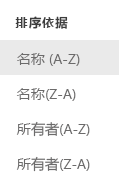

# 使用 Power BI 服务
## 左侧导航窗格

**快速参考指南**

| 操作 | 新（当前）路径 |
| --- | --- | --- |
| 收藏仪表板或报表 |“工作区”>“仪表板”或“工作区”>“报表”并选择星形图标将其变为黄色 |
| 收藏应用 | 在左侧导航窗口选择“应用”并选择应用名称旁边的星形
| 查看收藏列表 |从左侧导航窗格中选择“收藏夹” |
| 查看最近访问过的仪表板和报表的列表 |从左侧导航窗格中选择“最近使用的项目” |
| 查看已与你共享的仪表板列表 |从左侧导航窗格中选择“与我共享的内容” |
| 共享仪表板 |打开仪表板，然后选择“共享”或创建并发布应用 |
| 删除仪表板 |“我的工作区”>“仪表板”> 垃圾桶图标 |
| 删除报表 |“我的工作区”>“报表”> 垃圾桶图标 |
| 删除数据集 |“我的工作区”>“数据集”>“...”>“删除” |
| 打开仪表板 |“工作区”>“仪表板”，然后选择仪表板的名称 |
| 打开报表 |“工作区”>“报表”，然后选择报表的名称 |
| 打开数据集 |“工作区”>“数据集”，然后选择数据集的名称 |
| 创建仪表板 |从顶部导航栏选择“创建”>“仪表板” |
| 创建报表 |从顶部导航栏选择“创建”>“报表” |
| 创建数据集 |从顶部导航栏选择“创建”>“数据集” |
| 创建应用 |“工作区”>创建应用工作区 |
| 查看所拥有的所有仪表板、报表和数据集的列表 |“工作区”>“我的工作区” |

## 常见任务

请观看下面的视频，Amanda 将带你感受 Power BI 服务导航体验。  然后，按照视频下方的分步说明操作，自行进行探索。

<iframe width="560" height="315" src="https://www.youtube.com/embed/G26dr2PsEpk" frameborder="0" allowfullscreen></iframe>

## 查看内容（仪表板、报表、工作簿、数据集、工作区、应用）
让我们先来看看基本内容（仪表板、报表、数据集、工作簿）的组织方式。 在此之前，所有内容在左侧导航窗格中列出。 现在，你仍可以选择这种显示方式，但默认在工作区的上下文中按内容类型进行显示。 从左侧导航窗格（左侧导航窗格）中选择工作区后，关联内容（仪表板、报表、工作簿、数据集）的选项卡在 Power BI 画布右侧显示。

如果使用的是 Power BI 免费版，则只能看到一个工作区，即“我的工作区”。

### 收藏仪表板、报表和应用
利用收藏夹能快速访问你认为最重要的内容。  

1. 在打开的仪表板或报表中，选择右上角的“收藏”。
   
   
   
   此时，“**收藏**”变为“**取消收藏**”，星标变为黄色。
   
   

2. 对于应用，请在左侧导航窗格中选择“应用”，将鼠标悬停在该应用上，然后选择星形，添加到收藏夹。

2. 要显示已加入收藏夹的所有内容的列表，请在左侧导航窗格中选择“收藏夹”右侧的箭头。 由于左侧导航窗格是 Power BI 服务的永久性功能，因此可以在 Power BI 服务中的任何位置访问此列表。
   
    
   
    在这里，你可以选择一个仪表板、报表或应用来打开它。

3. 要打开“收藏夹”窗格，请在左侧导航窗格中选择“收藏夹”或选择收藏夹图标 。
   
   
   
   在这里，可以打开和查找内容、取消收藏或与同事共享内容。

1. 另一种将仪表板或报表标记为收藏的方法是利用“仪表板”或“报表”工作区选项卡。只需打开工作区，显示内容视图，并选择名称左侧的星形图标。
   
   

要了解详细信息，请参阅[收藏](service-dashboard-favorite.md)

### 最近访问
通过访问“最近访问”窗格，可快速获取最近访问的内容。 这包括来自所有工作区的内容。

  

与“收藏夹”类似，选择左侧导航窗格中“最近访问”旁边的箭头，可以在 Power BI 服务中的任何位置快速访问最近访问的内容。

  

若要了解详细信息，请参阅[Power BI 中最近使用的项目](service-recent.md)

### 应用
应用是仪表板和报表的集合，旨在于同一个位置提供所有关键指标。 可以在组织内部使用应用，也可[将应用用于外部服务](service-connect-to-services.md)，如 Google Analytics 和 Microsoft Dynamics CRM。 

若要了解详细信息，请参阅“应用工作区”（如下）以及[什么是 Power BI 应用](service-install-use-apps.md)。

### 与我共享
“与我共享”是同事与你共享的所有内容的位置。  按仪表板所有者进行筛选，使用搜索字段查找相关内容，再按日期对项进行排序。  对于频繁访问的共享内容，直接从“与我共享的内容”视图中进行收藏更为简便。

若要了解详细信息，请参阅[与我共享的内容](service-shared-with-me.md)

### 使用工作区
接下来，在左侧导航窗格中选择“工作区”。 可以将工作区看作是 Power BI 内容的容器。 有两种类型的工作区：**我的工作区**和应用工作区。

如果不是应用工作区的成员或管理员，可能不会在左侧导航栏中看到任何应用工作区。 如果是 Power BI 免费版客户，将不会看到任何应用工作区。

#### 我的工作区
**我的工作区**存储你拥有的所有内容。 可以将其作为你的个人沙盒或自己内容的工作区域。 你可以与同事共享“我的工作区”中的内容。 在“我的工作区”中，内容由 4 个选项卡组成：仪表板、报表、工作簿和数据集。

#### 应用工作区
应用和应用工作区是 Power BI Pro 的一项功能。 如果你是为其他人创作仪表板和报表的人员，则会使用应用工作区来执行此操作。 应用工作区是创建应用的地方，因此若要创建应用，首先需要创建应用工作区。 它们由组工作区演变而来，是存储应用内容的临时区域和容器。  你和你的同事可以在仪表板、报表以及你计划分发给广大受众甚至整个组织的其他内容上进行协作。

若要了解详细信息，请访问[在 Power BI 中创建和分发应用](service-create-distribute-apps.md#app-workspaces)。

在“我的工作区”中，内容由 4 个选项卡组成：仪表板、报表、工作簿和数据集。

通过选择左侧导航窗格中的“工作区”切换工作区。

### 对内容进行搜索和排序
借助内容视图，可以更轻松地对内容进行搜索、筛选和排序。 若要搜索仪表板、报表或工作簿，请在搜索区域中键入内容。 Power BI 会筛选出名称中包含搜索字符串的内容。

也可以按名称或所有者对内容进行排序。  

若要了解详细信息，请参阅 [Power BI 导航：搜索、排序、筛选](service-navigation-search-filter-sort.md)

## 后续步骤
Power BI 服务[基本概念](service-basic-concepts.md)    

有疑问或反馈吗？ [请访问 Power BI 社区论坛](http://community.powerbi.com/t5/Navigation-Preview-Forum/bd-p/NavigationPreview)

