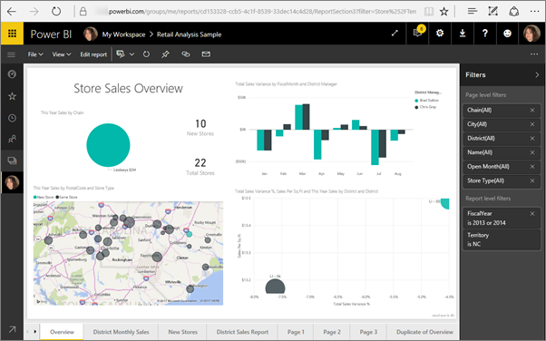

# <a name="filter-a-report-using-query-string-parameters-in-the-url"></a>通过在 URL 中添加查询字符串参数来筛选报表
在 Power BI 服务中打开报表时，报表的每一页都有自己的专属 URL。 若要筛选报表页，可以使用报表画布上的“筛选器”窗格。  也可以向 URL 添加查询字符串参数来筛选报表。 你可能有一个要向同事展示的报表，你希望为同事预筛选报表。 方法之一是，从报表的默认 URL 入手，向 URL 添加筛选参数，然后通过电子邮件向同事发送完整的 URL。


<iframe width="640" height="360" src="https://www.youtube.com/embed/WQFtN8nvM4A?list=PLv2BtOtLblH3YE_Ycas5B1GtcoFfJXavO&amp;showinfo=0" frameborder="0" allowfullscreen></iframe>

## <a name="query-string-parameter-syntax-for-filtering"></a>用于筛选的查询字符串参数语法
语法相当简单；从报表 URL 入手，然后依次添加问号和筛选语法。

URL?filter=***表***/***字段*** eq '***值***'


* **表**和**字段**名称区分大小写，**值**不区分大小写。
* 报表视图中隐藏的字段仍可供筛选。
* 必须用单引号将**值**括起来。
* 字段类型必须是字符串。
* 表和字段名称中不能有任何空格。

如果仍感到困惑，请继续阅读，我们将分部分讲解。  

## <a name="filter-on-a-field"></a>筛选一个字段
假设我们的报表 URL 如下。


从上文中的地图可视化效果可以看出，我们在北卡罗来纳州有商店。

>[!NOTE]
>本示例以[“零售分析”示例为依据“](sample-datasets.md)。
> 

若要从报表中筛选出“NC”（北卡罗来纳州）商店的数据，请在 URL 后面追加以下内容：

?filter=Store/Territory eq 'NC'


>[!NOTE]
>NC 是“Store”表的“Territory”字段中存储的值。
> 
> 

我们的报表针对北卡罗来纳州进行了筛选；报表页上的所有可视化效果都只显示北卡罗来纳州的数据。



## <a name="filter-on-multiple-fields"></a>筛选多个字段
还可以通过将其他参数添加到 URL 来筛选多个字段。 让我们回到最初的筛选器参数。

```
?filter=Store/Territory eq 'NC'
```

要对其他字段进行筛选，请添加 `and` 以及与上述格式相同的另一个字段。 示例如下。

```
?filter=Store/Territory eq 'NC' and Store/Chain eq 'Fashions Direct'
```

<iframe width="640" height="360" src="https://www.youtube.com/embed/0sDGKxOaC8w?showinfo=0" frameborder="0" allowfullscreen></iframe>


### <a name="using-dax-to-filter-on-multiple-values"></a>使用 DAX 来对多个值进行筛选
对多个字段进行筛选的另一方法是创建将两个字段合并成一个值的计算列。 然后，便可以筛选此值。

例如，我们有以下两个字段：“Territory”和“Chain”。 在 Power BI Desktop 中，[新建一个计算列](desktop-tutorial-create-calculated-columns.md)（字段），并将其命名为“TerritoryChain”。 请注意，**字段**名称中不能有任何空格。 下面是此计算列的 DAX 公式。

TerritoryChain = [Territory] & " - " & [Chain]

将报表发布到 Power BI 服务，然后使用 URL 查询字符串筛选出 NC 中 Lindseys 商店的数据。

https://app.powerbi.com/groups/me/reports/8d6e300b-696f-498e-b611-41ae03366851/ReportSection3?filter=Store/TerritoryChain eq 'NC–Lindseys'

## <a name="pin-a-tile-from-a-filtered-report"></a>将筛选后的报表中的可视化效果固定到磁贴中
使用查询字符串参数筛选报表后，便可以将此报表中的可视化效果固定到仪表板中。 仪表板上的磁贴会显示筛选出的数据，选择相应的仪表板磁贴会打开用于创建磁贴的报表。  不过，使用 URL 执行的筛选结果未与报表一起保存，选择仪表板磁贴后打开的报表处于未经筛选的状态。  也就是说，仪表板磁贴中显示的数据与报表可视化效果中显示的数据不一致。

在某些情况下，可能希望查看不同的结果（仪表板上显示筛选后的数据，报表中显示未经筛选的数据），那么这就会非常有帮助。

## <a name="limitations-and-troubleshooting"></a>限制和疑难解答
使用查询字符串参数时，需要注意两点。

* 查询字符串筛选不适用于[发布到 Web](service-publish-to-web.md) 或 Power BI Embedded。   
* 字段类型必须是字符串。
* 表和字段名称中不能有任何空格。

## <a name="next-steps"></a>后续步骤
[将可视化效果固定到仪表板](service-dashboard-pin-tile-from-report.md)  
[试用一下 - 完全免费！](https://powerbi.com/)

更多问题？ [尝试咨询 Power BI 社区](http://community.powerbi.com/)

